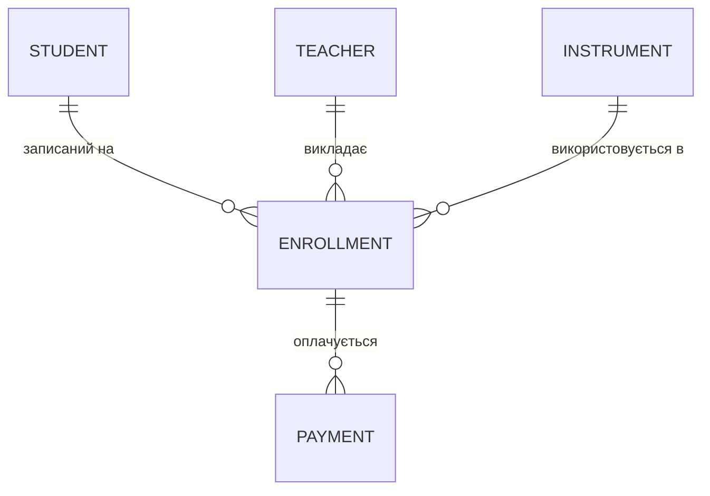
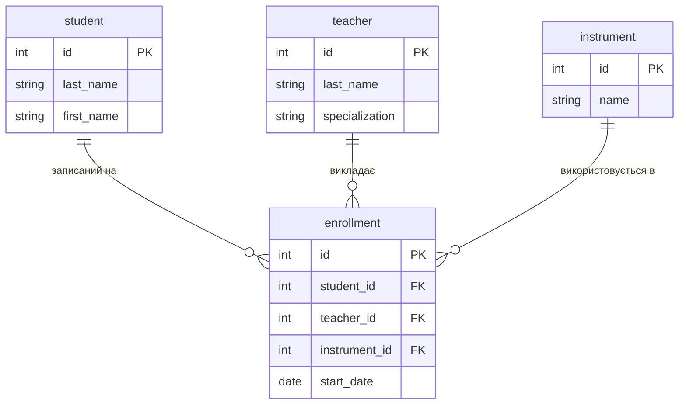
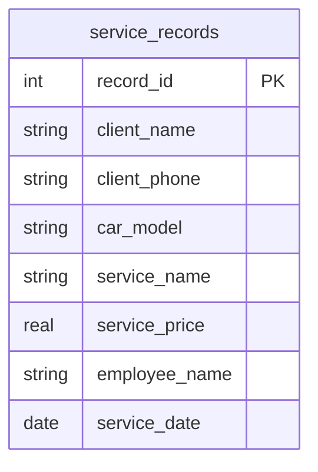
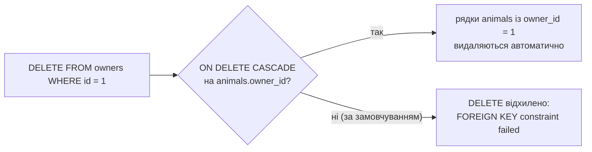

# Самостійна робота — Модуль 1. Основи баз даних і моделювання (SQLite)

Сім позицій цього модуля супроводжують Лекції 1–6 і закладають те, без
чого решта курсу не має сенсу: розуміння навіщо взагалі потрібна СУБД,
робочі інструменти, і перше вміння спроєктувати схему на папері перед
тим, як писати хоч рядок SQL. Загальний принцип роботи з самостійною —
на [сторінці огляду](index.md#як-користуватись-цим-розділом).

## Література до модуля

Українськомовне джерело, яке безпосередньо охоплює теми цього
модуля, — Мулеса О. Ю., Варга Я. *Інформаційні системи та реляційні
бази даних.* — Ужгород: УжНУ, 2018 ([відкритий доступ](https://www.uzhnu.edu.ua/en/infocentre/get/44979)):

- Розділ 1 ("СУБД як різновид інформаційних систем") — до позиції 1
  (історія розвитку баз даних).
- Розділ 2 ("Логічна структура даних... модель сутність-зв'язок") — до
  позицій 4-5 (ER-діаграми, ключі, зв'язки).
- Розділ 3 ("Реляційні бази даних... нормалізація, правила Кодда") —
  прямо до позиції 6 (нормальні форми).
- Розділ 4 ("Основи мови запитів SQL... INSERT, DELETE, UPDATE") — до
  позицій 3 і 7 (SELECT/WHERE, UPDATE/DELETE).

Для позиції 2 (встановлення SQLite/DB Browser) окрема література не
потрібна — це суто інструментальний крок, покроково описаний у самій
[Практиці 1](../practice/01-sqlite-create.md).

## 1. Історія розвитку баз даних (до заняття № 1, 2 год)

**Ваше завдання.** Коротко дослідіть і письмово (пів сторінки–сторінка)
викладіть еволюцію зберігання даних: файлове зберігання → ієрархічні й
мережеві бази даних (1960-ті) → реляційна модель (Кодд, 1970) → сучасні
NoSQL/NewSQL як реакція на масштаб і швидкість. Для кожного етапу
запишіть одним реченням, яку конкретну проблему попереднього підходу
він вирішував.

**Навіщо це потрібно.** Весь курс навчить вас писати SQL-запити й
проєктувати схеми, але жодна з цих навичок не має сенсу, якщо ви не
розумієте, яку саме проблему СУБД вирішує порівняно з "просто зберігати
все у файлах чи Excel". Це розуміння — те, що дозволяє потім
аргументовано відповісти на співбесіді чи в реальному проєкті на
питання "а навіщо нам тут узагалі база даних, не досить CSV-файлу?".

**Best practices:**

- Порівнюйте за конкретними критеріями, а не загальними словами:
  одночасний доступ кількох користувачів, цілісність даних (чи можна
  випадково зберегти суперечливі значення), мова запитів (чи можна
  запитати "усіх, хто..." без написання окремої програми), відновлення
  після збою.
- Використовуйте перевірені джерела (офіційна документація, підручники,
  Вікіпедія як відправна точка з посиланнями далі) — не переказ з
  першого-ліпшого блогу.
- Оформіть як компактну таблицю "етап → рік/період → яку проблему
  вирішив" — це змушує сформулювати відповідь стисло, а не розмито.

## 2. Встановлення SQLite і DB Browser for SQLite (до заняття № 2, 2 год)

**Ваше завдання.** Встановіть на свій комп'ютер обидва інструменти, з
якими курс працюватиме до самого Модуля 4: **CLI `sqlite3`** і
**DB Browser for SQLite (DB4S)**. Інструкції з посиланнями для
Windows/macOS/Linux — у розділі "Крок 1. Інструмент для SQL"
[Практики 1](../practice/01-sqlite-create.md). Створіть тестову
(не свою робочу) базу `test.db`, відкрийте її в DB Browser, і
переконайтесь, що `sqlite3 --version` у терміналі повертає версію, а не
помилку "команду не знайдено".

**Навіщо це потрібно.** Це єдиний робочий інструмент перших трьох
модулів курсу — якщо встановлення відкладене "на потім", воно спливе
рівно тоді, коли на практичному занятті всі вже пишуть SQL, а ви ще
шукаєте інсталятор. Краще зіткнутись із проблемами встановлення зараз,
самостійно і без дедлайну, ніж посеред заняття.

**Best practices:**

- Встановіть **обидва** інструменти, навіть якщо плануєте користуватись
  переважно одним — приклади курсу показують і CLI, і DB Browser, і
  корисно вміти читати обидва.
- Одразу запам'ятайте (запишіть собі), де фізично на диску лежить
  файл `.db`, який ви створюєте — плутанина "де моя база" коштує більше
  часу, ніж сама плутанина з синтаксисом SQL.
- Перевіряйте версію (`sqlite3 --version`), а не просто "запустилось
  без помилки" — стара версія іноді не підтримує функції, які
  знадобляться пізніше в курсі (наприклад, `RIGHT JOIN` з'явився лише
  в SQLite 3.39).

## 3. SELECT, WHERE, ORDER BY, NOT NULL (до заняття № 4, 3 год)

**Ваше завдання.** На таблиці-вимірі 1 свого варіанта (яку ви створили
в [Практиці 1](../practice/01-sqlite-create.md)) напишіть і виконайте
щонайменше 5 запитів `SELECT`, що поєднують `WHERE`, `ORDER BY` і хоча б
одну перевірку на `NOT NULL`/`IS NULL`.

**Навіщо це потрібно.** `SELECT` — запит, який ви писатимете найчастіше
за все, і в навчанні, і в реальній роботі. Швидкість, з якою ви зараз
звикнете комбінувати `WHERE`+`ORDER BY`, безпосередньо визначає, наскільки
легко вам дадуться складніші теми курсу (`JOIN`, `GROUP BY`), бо вони всі
будуються поверх цього самого фундаменту.

**Best practices:**

- Думайте про запит як про конвеєр: спершу `WHERE` звужує, яких рядків
  торкатись, і лише потім `ORDER BY` впорядковує те, що лишилось —
  не намагайтесь сортувати "все", а потім думати, як відфільтрувати.
- Не покладайтесь на здогад "ця колонка не може бути порожньою" — прямо
  перевірте оголошення таблиці (`.schema` у CLI чи вкладка Database
  Structure в DB Browser), чи справді там `NOT NULL`.
- Навмисно напишіть хоча б один запит, який поверне 0 рядків — важливо
  побачити порожній результат і зрозуміти, що це не помилка, а
  легітимна відповідь "нічого не задовольняє умову".

## 4. ER-діаграми: інструменти й концептуальна схема 5+ таблиць (до заняття № 6, 3 год)

**Ваше завдання.** Ознайомтесь із програмним рішенням для побудови
ER-діаграм, яке курс використовує — mermaid `erDiagram` (не окрема
програма для встановлення: код пишеться прямо в markdown-файлі й
рендериться автоматично, як у прикладах [Лекції 4](../lectures/04-er-modeling.md)
і [Практики 3](../practice/03-er-modeling.md)). Потім спроєктуйте **нову,
одноразову** предметну область (не один із 10 варіантів курсу і не
ветклініку з лекції) із **щонайменше 5 таблицями** на концептуальному
рівні — лише сутності та зв'язки, без типів даних і ключів.

**Навіщо це потрібно.** Ваш варіант курсу — це навмисно проста
"зірка" з 3 таблиць (2 виміри + 1 факт), щоб решта практик була
зрозумілою. Реальні бази даних рідко такі малі. Ця вправа — перший
крок до того, щоб самостійно розкласти складнішу предметну область (5+
пов'язаних сутностей) на таблиці, а не лише відтворити вже готову схему
курсу.

**Best practices:**

- Почніть зі слів, не з коду: випишіть іменники предметної області
  (хто/що бере участь) і дієслова між ними (хто що з ким робить) — саме
  дієслова зазвичай стають фактовими таблицями.
- Концептуальний рівень — це навмисно "без деталей": не додавайте типи
  даних чи первинні ключі на цьому кроці, лише сутності й зв'язки. Це
  окреме завдання — фізична схема буде наступною позицією.
- Перевірте кожен зв'язок питанням з обох боків: "скільки Б відповідає
  одному А?" і "скільки А відповідає одному Б?" — саме так визначається
  1:1, 1:N чи M:N (детальніше — [Лекція 4](../lectures/04-er-modeling.md)).

Приклад — концептуальна схема (без типів даних і ключів) для
одноразового домену "музична школа" (**не** використовуйте цей домен
для власної роботи, лише як зразок формату):



Це рівно той рівень деталізації, який очікується у вашому завданні —
назви сутностей і тип зв'язку між ними, без стовпців.

## 5. Первинні/зовнішні ключі, зв'язки 1:N і M:N, фізична схема 5+ таблиць (до заняття № 8, 3 год)

**Ваше завдання.** Перетворіть концептуальну схему з попередньої позиції
на **фізичну**: додайте кожній таблиці первинний ключ (`PK`), пропишіть
зовнішні ключі (`FK`) для кожного зв'язку, і для щонайменше одного
зв'язку M:N покажіть проміжну (junction) таблицю явно.

**Навіщо це потрібно.** Концептуальна діаграма каже "ці дві сутності
якось пов'язані", фізична — каже точно, яка колонка, у якій таблиці, з
яким типом даних, реалізує цей зв'язок. Це той рівень деталізації, який
реально виконується в `CREATE TABLE`, тому вміння дійти від
"якось пов'язані" до "оцей конкретний стовпець з `FOREIGN KEY`" —
головна практична навичка проєктування баз даних.

**Best practices:**

- Зв'язок M:N ніколи не реалізується двома зовнішніми ключами в одній
  із двох основних таблиць — завжди через окрему проміжну таблицю з
  двома `FK`, кожен на одну з сторін зв'язку (детальніше —
  [Лекція 4](../lectures/04-er-modeling.md), розділ про M:N).
- Первинний ключ практично завжди варто робити окремим автоінкрементним
  `id`, а не "природним" складеним ключем (наприклад, парою
  ім'я+телефон) — природні ключі мають звичку змінюватись чи повторюватись.
- Іменуйте зовнішній ключ за таблицею, на яку він посилається
  (`teacher_id` → `teacher`, не просто `id2`) — це саме той стиль
  іменування, який курс використовує для всіх 10 варіантів.

Фізична версія попереднього прикладу — зверніть увагу, як зв'язок
"студент відвідує заняття з інструментом" реалізовано через проміжну
таблицю `enrollment` з двома прямими `FK`, а M:N між студентом і
викладачем (один студент може мати кількох викладачів, один викладач —
багатьох студентів) — теж через неї:



Це навмисно **інший** одноразовий приклад, ніж у попередній позиції
(додано конкретні стовпці й ключі) — на своєму варіанті виконуйте
аналогічно: 5+ таблиць, PK на кожній, FK на кожному зв'язку, і хоча б
одна проміжна таблиця для M:N.

## 6. Нормальні форми (1НФ–3НФ) (до заняття № 10, 2 год)

**Ваше завдання.** Візьміть навмисно "невдало спроектовану" пласку
таблицю (приклад нижче) і покроково нормалізуйте її до 3НФ: спершу
приберіть повторювані групи (1НФ), потім усуньте часткову залежність
від складеного ключа (2НФ), потім усуньте транзитивну залежність між
не-ключовими стовпцями (3НФ). Результат — набір окремих таблиць із
ключами, схожий на те, що ви робили в позиціях 4–5.

**Навіщо це потрібно.** Нормалізація — це не абстрактна теорія заради
теорії, а конкретний інструмент проти реальних проблем: одна пласка
таблиця з дубльованими даними означає, що зміна телефону клієнта
вимагає виправити його в 50 рядках одразу (і легко забути хоч один), а
видалення останнього замовлення клієнта випадково стирає й сам факт
існування цього клієнта. Нормалізація — це систематичний спосіб
уникнути саме таких аномалій.

**Приклад "невдало спроектованої" таблиці** (одноразовий домен
"автомийка", не один із 10 варіантів курсу):

```
service_records(record_id, client_name, client_phone,
                 car_model, service_name, service_price,
                 employee_name, service_date)
```

Один рядок — один запис про надану послугу. Але ім'я й телефон клієнта
повторюються в кожному його замовленні; назва й ціна послуги
повторюються в кожному її наданні; ім'я співробітника — так само.

**Best practices:**

- На кожному кроці нормалізації задавайте собі одне питання: "якщо я
  зміню одне реальне значення (телефон клієнта, ціну послуги), скільки
  рядків мені доведеться виправити?" Якщо відповідь більша за 1 —
  таблицю ще не нормалізовано.
- 2НФ і 3НФ стосуються лише таблиць зі складеним первинним ключем або
  з не-ключовими стовпцями, які залежать один від одного (наприклад,
  `service_name` визначає `service_price`, а не первинний ключ
  напряму) — якщо ключ простий (один `id`) і всі інші стовпці залежать
  тільки від нього напряму, 2НФ і 3НФ вже виконуються автоматично.
- Не нормалізуйте "заради оцінки за форму" — кожна виділена таблиця
  повинна відповідати реальній самостійній сутності предметної області
  (клієнт, послуга, співробітник), а не бути штучним поділом заради
  поділу.



Після нормалізації ця одна таблиця стає чотирма: `client`, `service`,
`employee`, і фактова `booking` з трьома зовнішніми ключами — спробуйте
намалювати цю фінальну діаграму самостійно, за тим самим підходом, що
й у позиціях 4–5.

## 7. SQL-скрипти UPDATE/DELETE, демонстрація каскадного видалення (до заняття № 11, 3 год)

**Ваше завдання.** На своєму варіанті напишіть по 2 приклади `UPDATE`
(зміна одного і кількох стовпців за умовою) і 2 приклади `DELETE`
(видалення за умовою і — обережно — видалення без `WHERE` на тестовій
копії бази, щоб на власні очі побачити, що це видаляє геть усі рядки).
Потім продемонструйте каскадне видалення: додайте `ON DELETE CASCADE`
до зовнішнього ключа фактової таблиці (на тестовій копії файлу `.db`,
не на робочій), видаліть один рядок вимірної таблиці й перевірте, що
пов'язані рядки фактової таблиці зникли автоматично.

**Навіщо це потрібно.** `UPDATE`/`DELETE` без `WHERE` — одна з
найпоширеніших і найдорожчих помилок у реальній роботі з базами даних;
навичка спершу перевірити той самий `WHERE` через `SELECT` (скільки
рядків справді торкнеться) і лише потім запускати `UPDATE`/`DELETE` —
звичка, яку варто виробити зараз, на навчальних даних, а не вперше
на робочій базі.

**Best practices:**

- Перш ніж запускати `DELETE`/`UPDATE` з `WHERE`, виконайте `SELECT *`
  з тією самою умовою — якщо кількість рядків несподівана, зупиніться
  й перевірте умову, а не запускайте видалення "на всякий випадок".
- Тренуйте небезпечні команди (видалення без `WHERE`, каскадне
  видалення) виключно на **копії** файлу `.db`, ніколи на своїй
  робочій базі варіанта — просте `cp` файлу перед експериментом
  коштує секунду, відновлення втраченої бази — набагато дорожче.
- `ON DELETE CASCADE` зручний, але небезпечний за замовчуванням
  "тихий" — видалення одного рядка вимірної таблиці може непомітно
  стерти десятки пов'язаних рядків. Використовуйте його свідомо, а не
  як типову настройку "про всяк випадок".



**[← Огляд і графік самостійної роботи](index.md)**
