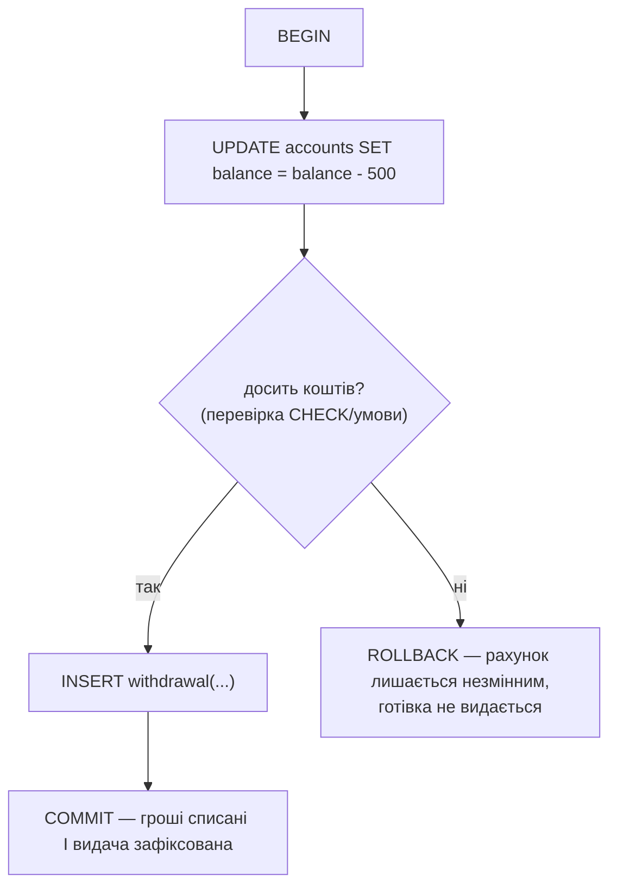

# Самостійна робота — Модуль 2. Розширені запити та аналіз даних у SQL (SQLite)

Сім позицій цього модуля супроводжують Лекції 7–14: від об'єднання
таблиць до перших транзакцій. Усі позиції, крім 13 і 14, виконуються на
тій самій трьохтабличній схемі вашого варіанта, що вже існує з
Практики 4 — жодних нових файлів заготовок не потрібно. Загальний
принцип роботи з самостійною — на
[сторінці огляду](index.md#як-користуватись-цим-розділом).

## Література до модуля

Мулеса О. Ю., Варга Я. *Інформаційні системи та реляційні бази
даних.* — Ужгород: УжНУ, 2018 ([відкритий доступ](https://www.uzhnu.edu.ua/en/infocentre/get/44979)) — Розділ 5
("Створення та обробка реляційної бази даних... запити, агрегатні
функції та багатотабличні операції") прямо охоплює позиції 8-11 (JOIN,
агрегатні функції, GROUP BY, HAVING); Розділ 4 (основи SQL) також
частково стосується позиції 12 (сортування й фільтрація).

Для позицій 13-14 (ACID, транзакції `BEGIN`/`COMMIT`/`ROLLBACK`) чистого
українськомовного джерела саме на рівні SQLite не знайдено — ці теми
викладені в самій [Лекції 13](../lectures/13-acid.md) і
[Лекції 14](../lectures/14-transactions.md) курсу; додатково можна
звернутись до офіційної документації SQLite (англ.) з допоміжної
літератури курсу.

## 8. Приклади JOIN (до заняття № 13, 3 год)

**Ваше завдання.** На своїй фактовій таблиці напишіть `INNER JOIN` з
обома вимірними таблицями одночасно (аналогічно Завданню 2
[Практики 7](../practice/07-joins.md)), а потім — окремий приклад
`LEFT JOIN`, що навмисно шукає рядки однієї з вимірних таблиць без
жодної пари у фактовій. Додатково складіть власний короткий
"шпаргальник": одне речення, коли використовувати `INNER`, а коли
`LEFT JOIN`.

**Навіщо це потрібно.** `JOIN` — це те, що перетворює три окремі
таблиці назад в один змістовний звіт для людини (замість `book_id = 3`
показати назву книги і прізвище читача в одному рядку). Це найчастіше
використовувана конструкція SQL після `SELECT`+`WHERE` в реальній
роботі з базами даних.

**Best practices:**

- Завжди пишіть явну умову `ON`, ніколи не покладайтесь на старий
  кома-синтаксис (`FROM a, b WHERE ...`) — один забутий `WHERE`
  перетворює його на `CROSS JOIN` з добутком рядків
  (див. [Лекція 7](../lectures/07-joins.md)).
- Називайте вихідні колонки описово через `AS` (`AS тварина`, а не
  безіменний `name` з незрозуміло якої з трьох таблиць).
- Для кожного `JOIN`, який пишете, подумки перевірте: чи можливий
  рядок з `NULL` у зовнішньому ключі — і чи саме такої поведінки ви
  хочете (зникне при `INNER`, залишиться з `NULL`-ами при `LEFT`).

## 9. Агрегатні функції: COUNT, SUM, AVG, MIN, MAX (до заняття № 15, 3 год)

**Ваше завдання.** На своїй фактовій таблиці виконайте всі п'ять
агрегатних функцій окремо, і додатково — цілеспрямовано перевірте, як
кожна з них поводиться з `NULL`: порівняйте `COUNT(*)` і
`COUNT(конкретна_колонка)` на колонці, де є хоча б один `NULL`, і
перевірте, чи `AVG`/`SUM` рахують `NULL`-рядок як 0 чи просто
пропускають його.

**Навіщо це потрібно.** Неправильне припущення про поведінку з `NULL`
— одна з найпоширеніших прихованих помилок у звітності: якщо очікувати,
що `AVG` порахує `NULL` як 0, середнє вийде заниженим, і ця помилка
непомітна, поки хтось не звірить цифри вручну.

**Best practices:**

- `COUNT(*)` рахує всі рядки, `COUNT(колонка)` — тільки рядки, де ця
  колонка не `NULL`; якщо ці два числа різні на вашій таблиці — ви
  щойно на власні очі знайшли пропущені значення.
- Ніколи не вважайте "за замовчуванням", що агрегатна функція трактує
  `NULL` як нуль — перевірте це реальним запитом на своїх даних, як у
  цьому завданні, а не з пам'яті.
- Фільтруйте (`WHERE`) до того, як агрегувати, якщо потрібно порахувати
  статистику лише для підмножини рядків — агрегатні функції рахують
  над тим, що вже пройшло `WHERE`.

## 10. Групування даних: GROUP BY (до заняття № 17, 3 год)

**Ваше завдання.** Побудуйте запит, що групує вашу фактову таблицю за
зовнішнім ключем (наприклад, кількість продажів на кожен товар) і
з'єднує результат з вимірною таблицею через `JOIN`, щоб у результаті
було людяне ім'я, а не `id`. Додатково перевірте на власній базі
особливість SQLite: спробуйте вибрати в `SELECT` колонку, якої немає в
`GROUP BY` і яка не обгорнута в агрегатну функцію — і запишіть, що саме
поверне SQLite (порівняно з тим, що сталось би у строгішій СУБД).

**Навіщо це потрібно.** `GROUP BY` — це перехід від "список окремих
рядків" до "статистика по категоріях", основа практично будь-якого
звіту чи дашборду. Особливість SQLite, яку варто перевірити самостійно,
— один із перших прикладів того, що те саме "працює" в одній СУБД може
бути помилкою в іншій (тут — PostgreSQL, з яким курс працюватиме в
Модулі 4).

**Best practices:**

- Пишіть у `SELECT` лише те, що або є в `GROUP BY`, або обгорнуте в
  агрегатну функцію — навіть якщо SQLite це дозволяє без явної
  помилки, це портативна звичка, яка не зламається при переході на
  PostgreSQL.
- `GROUP BY` працює з реальними значеннями стовпця, а не з псевдонімом
  (`AS`), заданим у тому самому `SELECT` — якщо потрібно згрупувати за
  обчисленим виразом, повторіть сам вираз у `GROUP BY`.
- Перевірте граничний випадок: група рівно з одним рядком — переконайтесь,
  що агрегатні функції (наприклад, `MIN`/`MAX`) на ній усе одно
  повертають очікуване значення, а не помилку.

## 11. Відбір груп: GROUP BY + HAVING (до заняття № 19, 3 год)

**Ваше завдання.** Побудуйте один запит, що використовує `WHERE`,
`GROUP BY` і `HAVING` одночасно: `WHERE` відфільтровує окремі рядки
до групування (наприклад, лише за останній рік), `GROUP BY` групує
результат, а `HAVING` залишає тільки ті групи, що задовольняють умову
над агрегатом (наприклад, лише товари, продані більше 3 разів).

**Навіщо це потрібно.** Плутанина `WHERE` проти `HAVING` — одна з
найчастіших помилок новачків у SQL, і саме тому, що обидві виглядають
як "умова фільтрації". Розуміння, що це два різні кроки одного
конвеєра запиту (`FROM → WHERE → GROUP BY → HAVING → SELECT`),
знімає плутанину раз і назавжди.

**Best practices:**

- Правило без винятків: `WHERE` фільтрує окремі рядки ДО групування,
  `HAVING` фільтрує вже готові групи ПІСЛЯ групування — і тому лише
  `HAVING` може містити агрегатну функцію (`HAVING COUNT(*) > 3`),
  спроба зробити так у `WHERE` дає помилку `misuse of aggregate`
  (перевірте це самі — навмисно напишіть невірний варіант і подивіться
  на точний текст помилки).
- Якщо умову можна виразити і через `WHERE`, і через `HAVING` без
  агрегата — завжди обирайте `WHERE`: воно відсіює рядки раніше й
  запит працює швидше.
- `HAVING` без `GROUP BY` теж синтаксично легальний (весь результат
  трактується як одна група) — спробуйте це як окремий експеримент і
  подивіться, що вийде.

## 12. Сортування та фільтрація: ORDER BY, DISTINCT, BETWEEN, IN, LIKE (до заняття № 21, 3 год)

**Ваше завдання.** На своєму варіанті напишіть по одному запиту на
кожну з п'яти конструкцій: `ORDER BY` за кількома колонками одразу,
`DISTINCT` на одній колонці, `BETWEEN` для діапазону (перевірте, що
обидві межі включно), `IN` замість ланцюжка `OR`, і `LIKE` з
шаблоном — свідомо на кириличному значенні, щоб перевірити регістр.

**Навіщо це потрібно.** Це п'ять інструментів, якими щодня
"причісується" сирий результат запиту до вигляду, придатного для
людини чи звіту — прибрати дублікати, показати в осмисленому порядку,
обмежити діапазон, знайти за частковим збігом тексту.

**Best practices:**

- `BETWEEN a AND b` включає обидві межі `a` і `b` — завжди перевіряйте
  граничні рядки окремо, а не покладайтесь на здогад.
- `IN (a, b, c)` читається набагато краще за довгий ланцюжок
  `OR` і менш схильний до помилки, коли хтось забуде одну умову при
  редагуванні.
- `LIKE` у SQLite регістронезалежний лише для символів ASCII, але
  **регістрозалежний для кирилиці** (`LIKE 'рекс'` не знайде `'Рекс'`)
  — перевірте це на власному кириличному значенні, а не повірте на
  слово: саме такі відмінності найлегше пропустити в реальній роботі.

## 13. Принципи ACID, приклади транзакцій (банкомат, онлайн-магазин) (до заняття № 23 [→ Лекція 13, заняття 25], 3 год)

**Ваше завдання.** Письмово (без SQL, це концептуальна вправа) розберіть
два класичні сценарії — зняття готівки в банкоматі та оформлення
замовлення в онлайн-магазині — і для кожного з чотирьох принципів ACID
(Atomicity, Consistency, Isolation, Durability) опишіть одним-двома
реченнями: що конкретно піде не так, якщо саме цю властивість
порушити. Потім спроєктуйте свій приклад: яка операція вашого варіанта
(наприклад, "продаж" = списати товар зі складу + додати рядок продажу)
теж вимагає атомарності двох дій одразу.

**Навіщо це потрібно.** ACID — не абстрактна теорія, а прямий опис
того, чому взагалі існують транзакції. Розібравши на словах, що саме
ламається без кожної властивості, ви розумієте, чому наступна позиція
(`BEGIN`/`COMMIT`/`ROLLBACK`) — не синтаксична формальність, а
конкретний захист від конкретної поламки.

**Best practices:**

- Для кожного принципу шукайте не загальне визначення, а один
  максимально конкретний сценарій поламки ("без Atomicity — гроші
  списались із рахунку, а видача готівки не відбулась через збій
  банкомата, і клієнт втратив гроші без товару").
- Isolation найлегше сплутати з іншими — тестуйте розуміння питанням
  "що станеться, якщо дві операції виконуються одночасно, а не
  послідовно?", а не "що станеться при збої".
- Перенесіть приклад на власний варіант курсу буквально, а не
  абстрактно — назвіть конкретні таблицю і стовпці вашої схеми, які
  мають змінитись разом, атомарно.

## 14. Транзакції в SQLite: BEGIN, COMMIT, ROLLBACK (до заняття № 24 [→ Лекція 14, заняття 26], 3 год)

**Ваше завдання.** На своєму варіанті оберіть дві пов'язані дії (за
зразком продажу з попередньої позиції: `INSERT` у фактову таблицю +
`UPDATE` вимірної таблиці) і виконайте їх у явній транзакції
(`BEGIN` … `COMMIT`). Потім свідомо відтворіть помилку: усередині
транзакції навмисно порушіть обмеження (наприклад, `UNIQUE` чи
`CHECK`), не викликайте `ROLLBACK`, і подивіться, що станеться, якщо
після цього все одно виконати `COMMIT`. Запишіть точний текст помилки
й те, яка частина роботи насправді зафіксувалась.

**Навіщо це потрібно.** Перевірений на цьому курсі факт — помилка
всередині транзакції SQLite **не скасовує її автоматично**: забутий
`ROLLBACK` і подальший `COMMIT` фіксує лише ту частину роботи, яка
встигла виконатись до помилки. Це неочевидно, поки не побачите на
власних даних, і саме тому ця позиція просить відтворити це самостійно,
а не просто прочитати про це.

**Best practices:**

- Ніколи не залишайте транзакцію "відкритою" після помилки без
  явного рішення — або `ROLLBACK` (скасувати геть усе), або свідомо
  виправлена повторна спроба тієї дії, що впала.
- Кожна транзакція повинна охоплювати тільки справді пов'язані дії —
  не об'єднуйте в одну транзакцію операції, які логічно не залежать
  одна від одної.
- Пам'ятайте перевірений факт курсу: вкладені `BEGIN` в SQLite
  заборонені (`cannot start a transaction within a transaction`) —
  переконайтесь явним `COMMIT`/`ROLLBACK`, що попередня транзакція
  справді завершена, перш ніж починати нову.
- Тестуйте саме шлях з помилкою, а не лише щасливий сценарій — на
  практиці транзакції захищають рівно від того випадку, коли щось іде
  не так.

**[← Огляд і графік самостійної роботи](index.md)**
