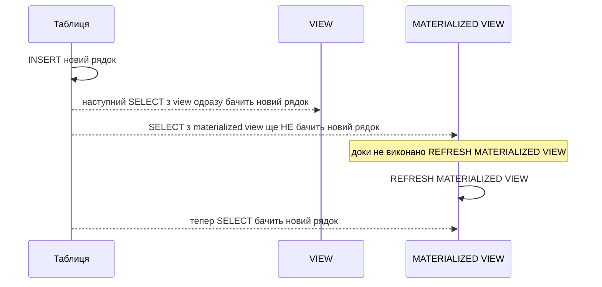
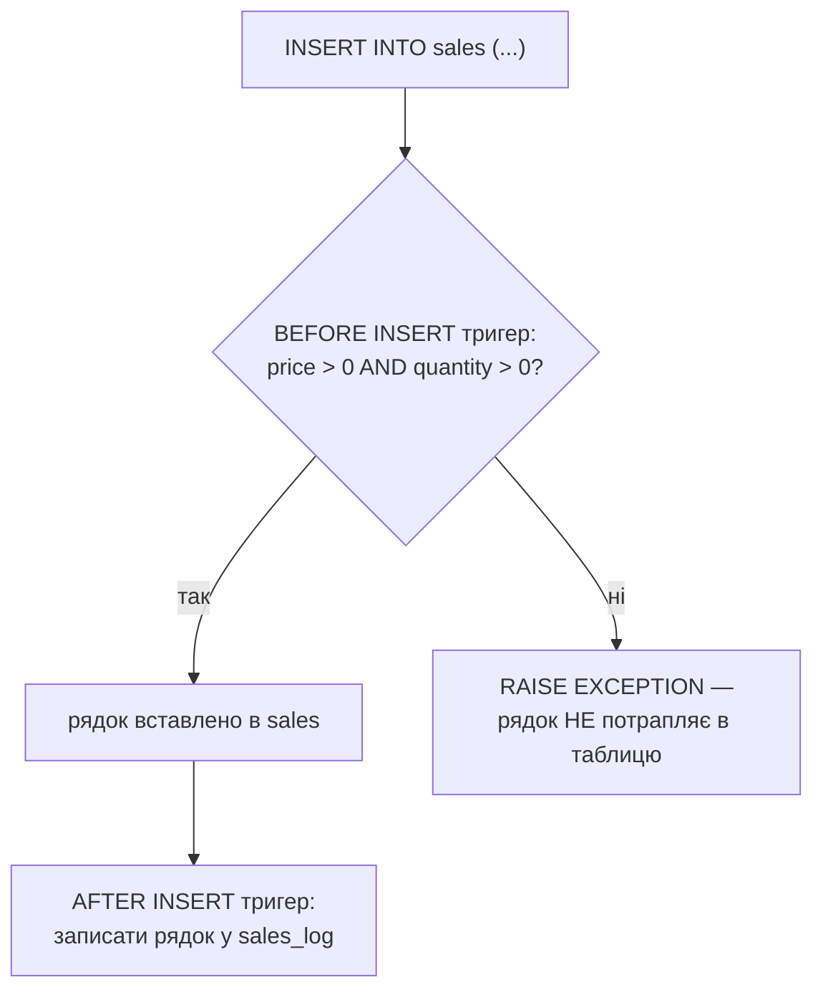

# Самостійна робота — Модуль 4. Розширені можливості PostgreSQL

П'ять позицій цього модуля супроводжують завершальні теми курсу —
Views, функції, процедури, тригери і, як підсумкова 23-тя позиція,
рівні ізоляції транзакцій. Усі виконуються на вашій схемі, вже
перенесеній у PostgreSQL у Практиці 16. Загальний принцип роботи з
самостійною — на [сторінці огляду](index.md#як-користуватись-цим-розділом).

## Література до модуля

Павловський В. І., Петрашенко А. В., Победа Д. В. *Бази даних та
засоби управління. Практикум.* — Київ: КПІ ім. Ігоря Сікорського, 2021
([відкритий доступ](https://ela.kpi.ua/server/api/core/bitstreams/1b620029-0db7-4e2e-83e7-32f7722a69be/content)):

- Розділ 9 ("Створення та виконання серверних процедур", с. 67) —
  прямо до позиції 21 (функції в курсі реалізовані як процедури з
  поверненням значення, той самий матеріал).
- Розділ 10 ("Створення та виконання тригерів", с. 79) — прямо до
  позиції 22.
- Розділ 8 ("Ізоляція транзакцій", с. 63) — прямо до позиції 23. Курс
  не має окремої лекції чи практики під номером 23 — рівні ізоляції
  згадуються в [Лекції 13](../lectures/13-acid.md) (ACID, властивість
  Isolation) і [Лекції 18](../lectures/18-postgres-intro.md); ця
  позиція самостійної — єдине місце курсу, де тема розкривається
  практично (`READ COMMITTED` проти `SERIALIZABLE`), тож цей розділ
  практикуму тут особливо доречний.

Для позиції 19 (Views/Materialized Views) українськомовного джерела не
знайдено — жодне з двох джерел курсу не має окремого розділу про
подання; спирайтесь на офіційну документацію PostgreSQL (англ.) з
допоміжної літератури курсу і на [Лекцію 19](../lectures/19-views.md) та
[Практику 18](../practice/18-views.md).

## 19. Views і Materialized Views у PostgreSQL (до заняття № 34 [→ Лекція 19, заняття 36], 3 год)

**Ваше завдання.** На своїй перенесеній у PostgreSQL схемі створіть
одне звичайне `VIEW` (наприклад, JOIN фактової таблиці з обома
вимірними, показує людяні значення) і одне `MATERIALIZED VIEW` з тим
самим запитом. Додайте новий рядок у вихідну таблицю й перевірте: чи
одразу видно зміну у звичайному поданні, і чи видно її в
матеріалізованому до `REFRESH MATERIALIZED VIEW`.

**Навіщо це потрібно.** Різниця між "завжди живий запит" і "фізичний
знімок даних на певний момент" — концептуально проста, але легко
переплутати на практиці, якщо не побачити її на власні очі: код
створення обох виглядає майже однаково, а поведінка — принципово різна.

**Best practices:**

- Обирайте звичайне `VIEW`, коли дані мають бути завжди актуальними, а
  сам запит не надто важкий для повторного виконання щоразу.
- Обирайте `MATERIALIZED VIEW`, коли той самий важкий запит
  виконується часто, а трохи застарілі дані (до наступного `REFRESH`)
  прийнятні — і завжди документуйте собі, за яким графіком воно
  оновлюється.
- Пам'ятайте: просте `VIEW` над однією таблицею дозволяє `INSERT`/
  `UPDATE` крізь себе (стовпці поза його `SELECT` отримують `NULL`/
  `DEFAULT`) — `MATERIALIZED VIEW` так не працює, це фізична копія, а
  не "вікно" в таблицю.



## 20. Реалізація функцій у PostgreSQL (до заняття № 36 [→ Лекція 20, заняття 38], 3 год)

**Ваше завдання.** Напишіть дві функції на своїй схемі, окремі від тих,
що вже зробили в Практиці 18: одну, що повертає скалярне значення
(наприклад, загальну суму продажів клієнта), і другу, що повертає
набір рядків через `RETURNS TABLE` + `RETURN QUERY` (наприклад, топ-N
записів фактової таблиці). Протестуйте кожну викликом у `SELECT`.

**Навіщо це потрібно.** Функція, яка інкапсулює логічний запит під
зрозумілою назвою (`SELECT total_sales(5)` замість повторення довгого
`JOIN`+`SUM` щоразу), — це те, що робить складну базу зручною для
використання іншими розробниками чи звітами, без потреби переписувати
той самий SQL щоразу.

**Best practices:**

- Пам'ятайте перевірений факт курсу: функція не може сама виконати
  `COMMIT` (`invalid transaction termination`) — для дій, що самі
  керують транзакцією, потрібна процедура (наступна позиція), не
  функція.
- Префіксуйте імена параметрів (наприклад, `p_client_id`), щоб вони
  візуально не збігались із назвами стовпців таблиці — інакше
  всередині функції легко переплутати, де параметр, а де колонка.
- Тестуйте функцію і на "порожньому" вході (клієнт без жодного
  продажу) — переконайтесь, що вона повертає осмислений результат
  (наприклад, 0 чи порожню множину рядків), а не помилку.

## 21. Реалізація процедур у PostgreSQL (до заняття № 38 [→ Лекція 21, заняття 40], 3 год)

**Ваше завдання.** Напишіть процедуру, що виконує на вашій схемі
атомарну пару дій із внутрішнім `COMMIT` — за зразком практичного
шаблону з [Лекції 21](../lectures/21-procedures.md) (наприклад,
"оформити продаж": списати одиницю товару зі складу + додати рядок у
фактову таблицю, обидві дії або відбуваються разом, або жодна).
Викличте її через `CALL` і перевірте результат.

**Навіщо це потрібно.** Процедура — саме той інструмент PostgreSQL,
який дозволяє керувати транзакцією зсередини (на відміну від функції),
тобто повторно використовувати саме той шаблон "атомарної пари дій",
який ви вже писали вручну в Позиції 14 (Модуль 2) через `BEGIN`/
`COMMIT` — тепер як один іменований, повторно використовуваний виклик.

**Best practices:**

- Викликайте процедуру через `CALL`, не через `SELECT` — спроба
  викликати як функцію дає чітку помилку з підказкою `HINT: To call a
  procedure, use CALL.`; якщо побачили цю помилку — ви просто переплутали
  синтаксис виклику, не зламали код.
- Використовуйте процедуру саме тоді, коли потрібен внутрішній контроль
  транзакції — якщо дію можна виразити без власного `COMMIT`, зазвичай
  простіше й безпечніше зробити її функцією.
- Задокументуйте прямо в назві чи короткому коментарі, **що саме**
  комітить ваша процедура і коли — це та інформація, яку неможливо
  побачити ззовні, просто дивлячись на виклик `CALL`.

## 22. Створення тригерів у PostgreSQL (до заняття № 40 [→ Лекція 22, заняття 42], 3 год)

**Ваше завдання.** Створіть два тригери на своїй фактовій таблиці:
`AFTER INSERT` для логування (записує факт додавання рядка в окрему
таблицю-журнал) і `BEFORE INSERT` для перевірки/блокування (наприклад,
забороняє вставку рядка з від'ємною ціною чи кількістю). Перевірте
обидва реальними спробами `INSERT` — окремо переконайтесь, що
заблокований `BEFORE`-тригером рядок дійсно не потрапив у таблицю.

**Навіщо це потрібно.** Тригер — єдиний механізм курсу, що виконується
автоматично, без явного виклику з коду застосунку, і саме тому легко
переоцінити чи недооцінити його: тестування "спробою реально вставити
неправильний рядок і подивитись, чи справді він не потрапив у таблицю"
— єдиний надійний спосіб переконатись, що тригер працює так, як
задумано.

**Best practices:**

- Тримайте логіку тригера мінімальною — важка логіка "прихована"
  всередині тригера є пасткою для супроводу: розробник, що читає код
  застосунку, не побачить, що `INSERT` насправді запускає ще й
  побічну дію в базі.
- Завжди тестуйте саме блокувальну поведінку `BEFORE`-тригера прямою
  спробою вставити "погані" дані — сам факт, що тригер створився без
  помилки синтаксису, нічого не каже про те, чи він справді блокує.
- Ведіть таблицю-журнал для `AFTER`-тригерів як окрему, просту таблицю
  — це і дає видиму історію дій, і полегшує діагностику, коли щось
  пішло не так.



## 23. Рівні ізоляції транзакцій у PostgreSQL: READ COMMITTED vs SERIALIZABLE (до заняття № 42, 3 год)

**Ваше завдання.** Відкрийте дві паралельні сесії `psql` (чи дві
вкладки Query Tool у PgAdmin) до своєї бази. У першій сесії почніть
транзакцію на рівні `READ COMMITTED` (типовий за замовчуванням у
PostgreSQL), прочитайте значення рядка, дайте другій сесії змінити й
закомітити цей самий рядок, потім прочитайте його ще раз у першій
сесії — і зафіксуйте, що значення змінилось у межах однієї
"незавершеної" транзакції. Повторіть той самий сценарій, але почавши
транзакцію першої сесії з `SET TRANSACTION ISOLATION LEVEL
SERIALIZABLE`, і зафіксуйте різницю в поведінці (аж до можливої
помилки серіалізації при спробі `COMMIT`).

**Навіщо це потрібно.** Ця позиція — офіційно не прив'язана до жодної
окремої лекції курсу (найближча за темою — Лекція 13, ACID, де
Isolation вперше з'являється як одна з чотирьох властивостей), і
навмисно є підсумковою: вона повертає вас до самого першого
теоретичного поняття курсу (Isolation з ACID), але вже не як
абстрактне визначення, а як конкретну, керовану налаштуванням
поведінку, яку можна ввімкнути, вимкнути й порівняти на власні очі.

**Best practices:**

- Відтворюйте сценарій з **двома окремими** сесіями одночасно (два
  вікна термінала чи дві вкладки PgAdmin) — на одній сесії явище
  неможливо побачити, бо немає паралельної другої дії, з якою
  порівнювати.
- `SERIALIZABLE` не "забороняє" паралельність — він виявляє конфлікт і
  повертає явну помилку серіалізації при спробі закомітити; правильна
  реакція застосунку на таку помилку — повторити транзакцію, а не
  вважати це збоєм бази.
- Обирайте рівень ізоляції свідомо під задачу: `READ COMMITTED`
  (типовий) достатній для більшості звичайних операцій і найшвидший;
  `SERIALIZABLE` — коли ціна рідкісної, але реальної гонки даних
  (наприклад, подвійне списання коштів) вища за витрати на повторні
  спроби.

```mermaid
sequenceDiagram
    participant T1 as Сесія 1 (READ COMMITTED)
    participant DB as PostgreSQL
    participant T2 as Сесія 2
    T1->>DB: BEGIN; SELECT balance FROM accounts WHERE id=1
    DB-->>T1: balance = 1000
    T2->>DB: UPDATE accounts SET balance=900 WHERE id=1; COMMIT
    T1->>DB: SELECT balance FROM accounts WHERE id=1 (той самий запит ще раз)
    DB-->>T1: balance = 900 — значення ЗМІНИЛОСЬ у межах транзакції T1
    T1->>DB: COMMIT
```

**[← Огляд і графік самостійної роботи](index.md)**
