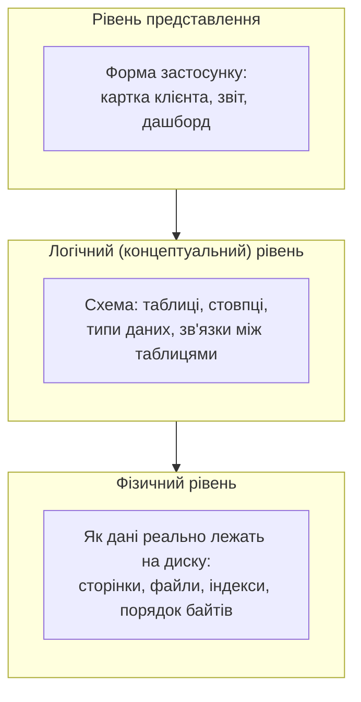
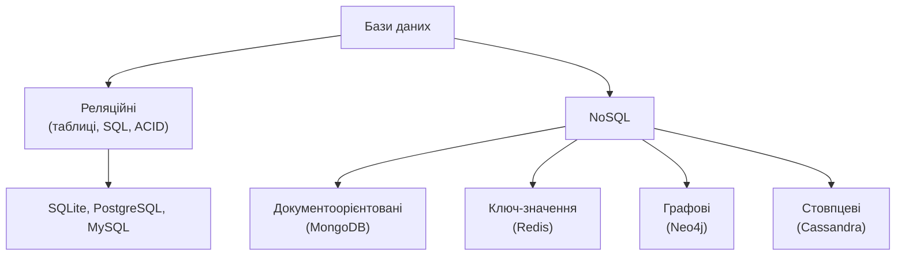

# Лекція 1. Вступ. Що таке база даних? Архітектура СУБД. Типи баз даних

*Курс "Бази даних в інформаційних системах": що таке база даних і чим вона
відрізняється від "просто файлу", що робить СУБД, з яких рівнів вона
складається, які типи баз даних існують і чому саме реляційна модель
(SQLite, а далі PostgreSQL) — основний інструмент цього курсу.*

## Чому не досить файлу

Уявімо задачу без жодної бази даних: список клієнтів компанії лежить у
звичайному Excel-файлі на спільному диску. Поки компанія маленька, це
працює. Але уявімо конкретну ситуацію:

Два співробітники одночасно відкривають цей файл. Перший додає нового
клієнта і зберігає файл. Другий, не знаючи про це, вже мав файл відкритим
у себе, виправляє телефон іншого клієнта і зберігає — і його збереження
**перезаписує весь файл цілком**, включно з клієнтом, якого щойно додав
перший співробітник. Дані не пошкоджені технічно (файл відкривається),
але клієнт зник — без жодного повідомлення про помилку.

Це не поодинока прикрість Excel, а закономірний наслідок файлового
зберігання при зростанні обсягу даних і кількості людей, що з ними
працюють:

- **Дублювання даних.** Той самий клієнт часто вводиться повторно в
  іншому файлі (наприклад, ще і в файлі бухгалтерії) — і рано чи пізно
  два записи розходяться (різна адреса, різний телефон), і незрозуміло,
  який правильний.
- **Відсутність контролю паралельного доступу.** Файл не знає, що з ним
  одночасно працюють двоє — саме це сталося у прикладі вище.
- **Відсутність гарантій цілісності.** Ніщо не забороняє ввести дату
  народження клієнта в майбутньому чи залишити поле email порожнім, якщо
  програма-редактор цього не перевіряє сама.
- **Складність пошуку й узгодженого зберігання зв'язків.** "Показати всіх
  клієнтів із трьома і більше замовленнями за минулий місяць" у Excel
  означає вручну зводити дані з кількох аркушів чи файлів — і робити це
  щоразу заново.

**База даних** — структурований, організований набір даних, який
дозволяє ефективно зберігати, шукати, змінювати й підтримувати
цілісність цих даних, зокрема саме тоді, коли з ними одночасно працює
багато людей чи програм. Ключове тут не "файл із даними" (Excel теж
файл із даними), а **гарантії**: база даних гарантує, що два одночасні
записи не знищать один одного, що обов'язкове поле не залишиться
порожнім, що пошук за умовою виконається за секунди навіть на мільйонах
рядків.

## Що таке СУБД

Ці гарантії дані не забезпечують самі по собі — їх забезпечує окрема
програма, яка стоїть між прикладним застосунком і фізичними даними на
диску: **система управління базами даних (СУБД)**. Застосунок (сайт,
мобільний додаток, бухгалтерська програма) ніколи не читає й не пише
байти на диск самостійно — він звертається до СУБД, а вже СУБД вирішує,
як саме зберегти чи знайти дані фізично.

СУБД бере на себе те, що інакше довелося б писати вручну в кожному
застосунку окремо:

- **Мову запитів** — стандартизований спосіб сказати "дай мені", "додай",
  "зміни", "видали" (в реляційних СУБД — SQL), однаковий незалежно від
  того, яка саме прикладна програма звертається до бази.
- **Контроль доступу** — хто має право читати чи змінювати які дані.
- **Цілісність даних** — правила, які СУБД перевіряє сама, а не довіряє
  прикладній програмі (наприклад: це поле не може бути порожнім, це
  значення має бути унікальним).
- **Паралельний доступ** — саме той механізм, якого не було у прикладі з
  Excel: СУБД впорядковує одночасні запити так, щоб два записи не
  знищили один одного.
- **Відновлення після збоїв** — якщо живлення зникло посеред запису,
  СУБД здатна повернути дані до останнього узгодженого стану, а не
  лишити файл наполовину пошкодженим.

## Архітектура СУБД: три рівні

Щоб надати всі ці гарантії, СУБД внутрішньо розділяє "що бачить
користувач" від "як дані реально влаштовані на диску" — це прийнято
описувати трирівневою архітектурою.

- **Фізичний рівень** — як дані реально розміщені на диску: у яких
  файлах, сторінках, у якому порядку байтів. Розробник застосунку про це
  практично ніколи не думає напряму — цим займається сама СУБД.
- **Логічний (концептуальний) рівень** — те, що бачить розробник:
  таблиці, стовпці та їхні типи, зв'язки між таблицями (наприклад,
  "кожне замовлення належить одному клієнту"). Саме на цьому рівні
  проєктується схема бази — і саме цим курс буде займатися практично
  весь час.
- **Рівень представлення** — те, що бачить кінцевий користувач через
  застосунок: форма для введення клієнта, звіт із сумою продажів за
  місяць, картка товару. Той самий рядок логічної таблиці може
  показуватись по-різному в різних формах, не змінюючи фізичного чи
  логічного рівня.

Розділення на рівні означає, що зміна одного з них не обов'язково
торкається інших: СУБД може перекласти файли даних на новий диск
(фізичний рівень) без жодної зміни таблиць і запитів (логічний рівень);
дизайнер може перемалювати форму застосунку (рівень представлення) без
жодної зміни таблиць у базі.

## Типи баз даних

Не всі бази даних організовані як таблиці. Історично й досі
найпоширеніша модель — **реляційна**: дані представлені як набір таблиць
із чітко визначеними стовпцями, а зв'язки між таблицями встановлюються
через спільні значення (ключі). Реляційні СУБД говорять мовою SQL і
зазвичай гарантують властивості **ACID** (атомарність, узгодженість,
ізольованість, довговічність — детально в Модулі 3 курсу) — саме той
набір гарантій цілісності й паралельного доступу, про який йшлося вище.
Приклади: **SQLite**, **PostgreSQL**, **MySQL**.

Але для деяких задач жорстка таблична структура заважає більше, ніж
допомагає — тому існує ціла родина **NoSQL** (буквально "не тільки SQL")
підходів:

- **Документоорієнтовані** (напр. **MongoDB**) — кожен запис — це
  самодостатній документ (найчастіше у форматі, подібному до JSON), без
  вимоги, щоб усі документи мали однаковий набір полів. Зручно, коли
  структура даних часто змінюється або суттєво відрізняється від запису
  до запису.
- **Ключ-значення** (напр. **Redis**) — найпростіша модель: кожному
  унікальному ключу відповідає одне значення. Надзвичайно швидко для
  простого пошуку за ключем — часто використовується як кеш перед
  "справжньою" базою даних.
- **Графові** (напр. **Neo4j**) — дані представлені як вузли й зв'язки
  між ними; зручно, коли головне питання — саме структура зв'язків
  (наприклад, "хто з ким знайомий через не більше двох спільних
  друзів").
- **Стовпцеві** (напр. **Cassandra**) — дані фізично зберігаються по
  стовпцях, а не по рядках; ефективно для аналітичних запитів над
  величезними обсягами однотипних даних.

## Чому саме реляційні бази — і чому саме з них починає курс

Реляційна модель була формально описана Едгаром Коддом ще у 1970-х
роках, і попри понад пів століття розвитку альтернатив вона й досі
лишається домінантною моделлю саме для структурованих даних із чіткими
зв'язками між сутностями (клієнти, замовлення, товари, студенти, оцінки
— типові приклади, з якими працює курс). Причина не історична інерція, а
поєднання трьох речей одразу: чіткі гарантії цілісності (ACID), єдина
стандартизована мова запитів (SQL, яка з невеликими відмінностями
працює в SQLite, PostgreSQL, MySQL й багатьох інших СУБД) і те, що
розуміння реляційної моделі суттєво полегшує розуміння решти підходів
(NoSQL-системи часто самі запозичують окремі реляційні ідеї або
навпаки — свідомо від них відмовляються, і зрозуміти, від чого саме,
можна лише знаючи, що це таке).

Саме тому весь курс далі побудований на реляційних СУБД: спочатку
**SQLite** — щоб зосередитись на самій мові SQL і проєктуванні схеми без
відволікання на встановлення сервера, а згодом, у Модулі 4, — **PostgreSQL**,
де ті самі реляційні ідеї працюють у повноцінному клієнт-серверному
середовищі. Наступна лекція починає саме з SQLite: як створити першу
базу даних, якими способами з нею працювати і які типи даних вона
підтримує.

## Рекомендована література

Жученко А. І., Ярощук Л. Д. *Проєктування інформаційних систем: Бази даних.* — Київ: КПІ ім. Ігоря Сікорського, 2022 ([відкритий доступ](https://files.znu.edu.ua/files/Bibliobooks/Inshi83/0063533.pdf)). Розділ 1 — основні поняття: інформація, дані, база даних, СУБД, автоматизовані інформаційні системи; класифікація ІС.

Павловський В. І., Петрашенко А. В. *Бази даних та засоби управління.* — Київ: КПІ ім. Ігоря Сікорського, 2024 ([відкритий доступ](https://ela.kpi.ua/bitstreams/9f26675d-c42f-485e-aab5-13e6e014b560/download)). Вступний розділ підручника — призначення, організація та застосування сучасних баз даних і систем керування базами даних (СКБД).
