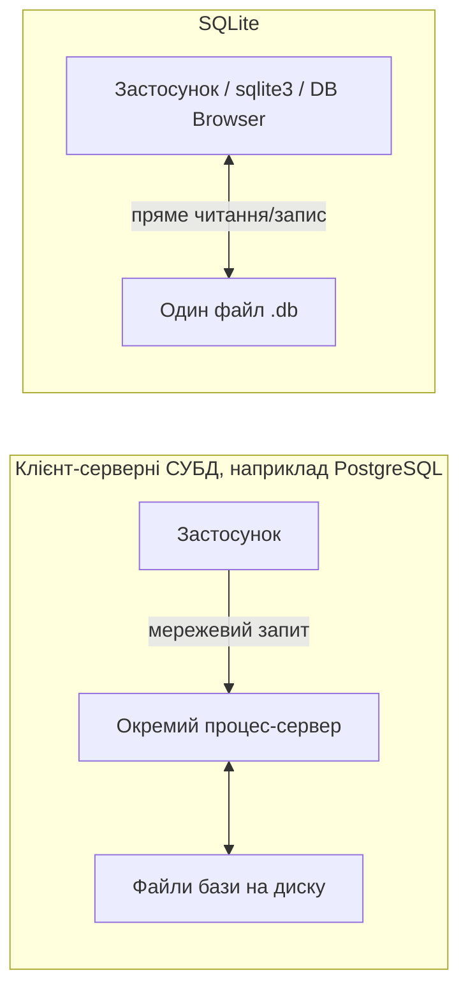
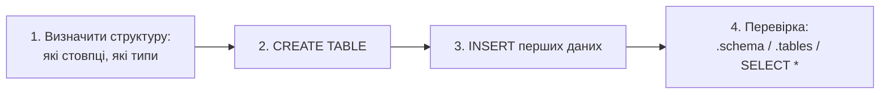

# Лекція 2. Створення бази даних у SQLite: CLI, SQLiteBrowser. Типи даних

*Перша практична робота з реляційною базою даних: чому курс починає саме
з SQLite, два способи з нею працювати (командний рядок і графічний
DB Browser for SQLite), особливості типів даних SQLite і створення
першої таблиці.*

З усіх типів баз даних, про які йшлося в попередній лекції, курс
починає саме з реляційних — і з усіх реляційних СУБД перший інструмент
курсу — **SQLite**. Причина проста: SQLite дозволяє зосередитись на самій
мові SQL і проєктуванні таблиць, не витрачаючи заняття на встановлення й
налаштування сервера бази даних.

## Чому саме SQLite для початку курсу

**Механіка.** SQLite — файлова, безсерверна СУБД: уся база даних — це
**один файл** на диску (типово з розширенням `.db` або `.sqlite`), і
жодного окремого процесу-сервера, який має бути запущений, слухати порт
і працювати у фоновому режимі, не існує. Програма, яка звертається до
бази (чи то `sqlite3` командного рядка, чи то Python-скрипт, чи то
DB Browser for SQLite), просто відкриває цей файл безпосередньо —
бібліотека SQLite вбудовується прямо в програму-клієнт.



**Чому це вигідно для навчання.** Нуль налаштування — файл бази
створюється в момент першого звернення до нього, без встановлення
сервера, користувачів чи прав доступу. Переносимість — весь стан бази
це один файл, який легко скопіювати, надіслати викладачу чи покласти в
репозиторій. Це ті самі властивості, які роблять SQLite популярним і в
реальних застосунках — мобільні додатки, браузери й багато десктопних
програм зберігають локальні дані саме в SQLite.

**Де ця простота закінчується.** Плата за відсутність сервера —
відсутність повноцінної підтримки **паралельного запису багатьма
користувачами одночасно**: SQLite дозволяє багатьом читати файл бази
одночасно, але записувати в конкретний момент може лише один процес,
решта запитів на запис чекають. У навчальних завданнях це непомітно —
з файлом працює одна людина. Але це прямо та причина, чому курс згодом
(Модуль 4) переходить на **PostgreSQL**: повноцінний сервер, розрахований
саме на багато одночасних клієнтів, що записують дані.

## Два способи роботи з SQLite

### CLI: `sqlite3`

Командний рядок `sqlite3` — найпростіший спосіб відкрити базу і
виконувати SQL-запити напряму, без графічного інтерфейсу. Крім
звичайних SQL-команд (`CREATE TABLE`, `INSERT`, `SELECT`, …), `sqlite3`
підтримує спеціальні **команди-крапки** (dot-commands), які самим SQL не
є, а керують самим `sqlite3`:

```sql
.open moya_baza.db      -- відкрити (або створити) файл бази
.tables                 -- показати список таблиць у поточній базі
.schema                 -- показати SQL-визначення всіх таблиць
.schema animals         -- те саме, але лише для однієї таблиці
.mode column            -- виводити результати SELECT у вигляді стовпців
.headers on             -- показувати заголовки стовпців у результаті
```

CLI зручний, коли потрібно швидко виконати кілька команд, автоматизувати
дії скриптом або коли графічного середовища просто немає (наприклад, на
сервері).

### DB Browser for SQLite (DB4S)

**DB Browser for SQLite** (скорочено **DB4S**, раніше відомий як
"SQLite Database Browser") — безкоштовна графічна програма для перегляду
й редагування баз SQLite без написання SQL-команд для найпростіших дій:
відкрити файл `.db`, побачити список таблиць і їхню структуру у вигляді
таблиці, погортати чи відфільтрувати рядки, а також виконати довільний
SQL-запит у вбудованій вкладці "Execute SQL".

**Коли який зручніший.** CLI швидший для тих, хто вже впевнено пише SQL і
хоче виконати команду в одну строку; DB Browser зручніший для перегляду
структури й даних одним поглядом (схоже на те, як виглядає ER-діаграма,
але для вже створеної бази) і для тих, хто ще звикає до синтаксису SQL.
Обидва інструменти працюють з тим самим файлом `.db` — можна вільно
перемикатися між ними в межах однієї роботи.

## Типи даних SQLite

**Механіка.** На відміну від більшості інших СУБД, SQLite використовує
**динамічну типізацію стовпця**, яка називається **type affinity**
("афінність типу"). Стовпець оголошується з одним із п'яти базових типів
афінності:

| Тип (affinity) | Що зберігає |
|---|---|
| `INTEGER` | ціле число |
| `TEXT` | текстовий рядок |
| `REAL` | число з рухомою комою (дробове) |
| `BLOB` | довільні бінарні дані "як є", без перетворення |
| `NUMERIC` | число (ціле чи дробове); намагається зберегти значення компактно |

Слово "афінність" тут ключове: оголошений тип стовпця — це лише
**рекомендація**, до якої SQLite схиляє (affinity — "тяжіння") значення
під час запису, а не сувора заборона. Технічно в стовпець, оголошений
як `INTEGER`, можна фізично записати рядок тексту — SQLite це дозволить.

**Чому це відрізняється від PostgreSQL.** Коли курс дійде до Модуля 4 —
PostgreSQL — там типи стовпців **суворі**: спроба вставити текст у
стовпець типу `integer` завжди завершиться помилкою, без винятків. Це
важлива концептуальна пастка: код і звичка, вироблені на SQLite ("а, ця
помилка типів мене не спіткає, SQLite якось підлаштується"), не
переносяться напряму на PostgreSQL. Тому вже зараз варто ставитися до
оголошених типів як до контракту, який слід дотримуватись свідомо, навіть
якщо сам SQLite цей контракт примусово не перевіряє.

## Створення бази й таблиці

Наскрізний приклад цієї лекції — ветклініка: таблиця тварин, яких
привели на прийом. Ідентифікатори таблиць і стовпців у цьому курсі —
англійською мовою, у стилі `snake_case` (так заведено в реальній
практиці роботи з SQL); самі ж дані (значення в рядках) лишаються
українською.

```sql
-- відкриває файл vetklinika.db, якщо він ще не існує — створює його
.open vetklinika.db

CREATE TABLE animals (
    id                 INTEGER PRIMARY KEY,
    name               TEXT NOT NULL,
    species            TEXT NOT NULL,
    breed              TEXT,
    birth_date         TEXT,
    weight             REAL
);
```

Що тут відбувається за рядками:

- `id INTEGER PRIMARY KEY` — первинний ключ: унікальний ідентифікатор
  кожного рядка. У SQLite стовпець, оголошений саме так (`INTEGER
  PRIMARY KEY`), автоматично отримує наступне ціле число при кожному
  `INSERT`, якщо значення не вказане явно — зручно, щоб не придумувати
  ідентифікатори вручну.
- `name TEXT NOT NULL` — кличка тварини, текст, обов'язкове поле
  (`NOT NULL` — детальніше про обмеження цілісності в Лекції 6).
- `species TEXT NOT NULL` — вид тварини (кіт, пес, …), теж обов'язковий.
- `breed TEXT` — порода, необов'язкове поле (значення може бути
  невідомим).
- `birth_date TEXT` — дата народження. У SQLite немає окремого типу
  "дата" — дати зазвичай зберігають як текст у форматі `YYYY-MM-DD`, що
  дозволяє їх і сортувати, і читати як звичайний текст.
- `weight REAL` — вага, дробове число.

Перевірити, що таблиця створена правильно, і додати перші дані:

```sql
INSERT INTO animals (name, species, breed, birth_date, weight)
VALUES ('Барсик', 'кіт', 'британська', '2022-03-14', 4.2);

.tables
-- animals

.schema animals
-- CREATE TABLE animals (
--     id                 INTEGER PRIMARY KEY,
--     name               TEXT NOT NULL,
--     ...
-- );

SELECT * FROM animals;
-- 1|Барсик|кіт|британська|2022-03-14|4.2
```

Загальний порядок дій при створенні будь-якої нової бази однаковий:



**Практика до цієї лекції:** [Практика 1. Створення бази даних у SQLite](../practice/01-sqlite-create.md)

## Рекомендована література

Харів Н. О. *Бази даних та інформаційні системи.* — Рівне: НУВГП (Національний університет водного господарства та природокористування), 2018 ([відкритий доступ](https://ep3.nuwm.edu.ua/9129/3/%D0%A5%D0%B0%D1%80%D1%96%D0%B2%20%D0%9D.%D0%9E.pdf)). Практична частина (розділ II) — SQL-мова, CREATE TABLE, типи даних (на прикладі Firebird/IBExpert, не SQLite — див. gaps).

Павловський В. І., Петрашенко А. В. *Бази даних та засоби управління.* — Київ: КПІ ім. Ігоря Сікорського, 2024 ([відкритий доступ](https://ela.kpi.ua/bitstreams/9f26675d-c42f-485e-aab5-13e6e014b560/download)). Розділ про SQL і роботу з СКБД — синтаксис CREATE TABLE, типи даних (на прикладі PostgreSQL, не SQLite — див. gaps).
