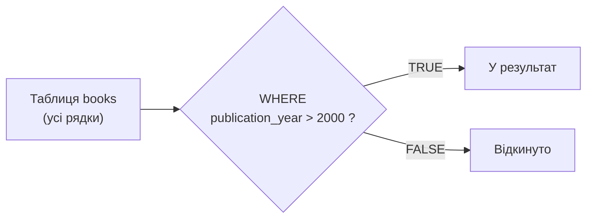
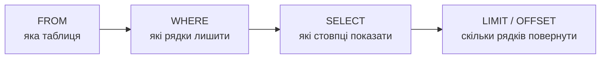

# Лекція 3. Вибірка даних з таблиць: SELECT, LIMIT, WHERE, NOT NULL

*У Лекції 2 таблицю створили і наповнили рядками командою `INSERT`. Але
таблиця, дані з якої ніхто не може дістати назад, — марна. Ця лекція про
зворотній рух: як забрати з таблиці саме ті рядки й саме ті стовпці, які
потрібні прямо зараз, а не всю таблицю цілком.*

## SELECT: базовий синтаксис

Мінімальний запит вибірки складається з двох частин — що дістати
(`SELECT`) і звідки (`FROM`):

```sql
SELECT title, author, publication_year
FROM books;
```

СУБД повертає **набір результату** (result set) — тимчасову таблицю,
побудовану саме для цього запиту: ті стовпці, які перелічені після
`SELECT`, і всі рядки з `books` (поки що без фільтрації — вона з'явиться
нижче, у `WHERE`).

Замість переліку стовпців можна написати `*` — «усі стовпці, у тому
порядку, в якому вони визначені в таблиці»:

```sql
SELECT * FROM books;
```

### Чому в робочому коді краще уникати `SELECT *`

`SELECT *` зручний для швидкого перегляду даних вручну — і саме так він
використовуватиметься на початку курсу. Але як частина коду застосунку
чи звіту, який виконується регулярно, явний перелік стовпців практично
завжди кращий, з кількох конкретних причин:

- **Читабельність.** `SELECT name, price FROM products` одразу повідомляє,
  які саме дані очікує код нижче. `SELECT *` не каже нічого — потрібно
  окремо перевіряти структуру таблиці, щоб зрозуміти, що прийде.
- **Стійкість до зміни схеми.** Якщо через півроку до таблиці додадуть
  новий стовпець (наприклад, `description`), запит із `*` мовчки почне
  повертати його теж — і код, який очікував рядок фіксованої довжини чи
  фіксованого порядку стовпців, може зламатися або отримати зайві дані
  там, де на них не чекали. Явний перелік стовпців від такої зміни схеми
  не залежить: він поверне рівно те, що перелічено, незалежно від того,
  що ще додали до таблиці.
- **Обсяг переданих даних.** Якщо з десяти стовпців таблиці потрібні лише
  два, `SELECT *` усе одно передає всі десять по мережі й у пам'яті
  програми — зайва робота, яка помітна на великих таблицях.

Тому загальне правило: під час дослідження даних вручну — `*` цілком
доречний; у запиті, який стає частиною коду, звіту чи навчального
завдання, що перевіряється, — явний перелік стовпців.

## WHERE: фільтрація рядків

`SELECT` без `WHERE` повертає всі рядки таблиці. `WHERE` додає умову —
**предикат**, який обчислюється окремо для кожного рядка, і в результат
потрапляють лише ті рядки, для яких предикат дав `TRUE`:

```sql
SELECT title, publication_year
FROM books
WHERE publication_year > 2000;
```

Основні оператори порівняння працюють так само, як у більшості мов
програмування:

| Оператор | Значення |
|---|---|
| `=` | дорівнює |
| `<>` або `!=` | не дорівнює |
| `<`, `>` | менше, більше |
| `<=`, `>=` | менше або дорівнює, більше або дорівнює |

Кілька умов об'єднуються логічними операторами `AND` (і — усі умови
мають бути істинними), `OR` (або — достатньо однієї) та `NOT`
(заперечення):

```sql
SELECT title, genre, publication_year
FROM books
WHERE genre = 'фантастика' AND publication_year > 2010;

SELECT title, copies_count
FROM books
WHERE copies_count = 0 OR copies_count > 10;
```

Коли в одному запиті поєднуються `AND` і `OR`, варто явно ставити
дужки — `AND` має вищий пріоритет, ніж `OR`, і без дужок запит легко
прочитати не так, як його виконає СУБД:

```sql
-- без дужок: спрацює як (genre = 'драма' AND publication_year > 2015) OR genre = 'поезія'
SELECT * FROM books WHERE genre = 'драма' AND publication_year > 2015 OR genre = 'поезія';

-- з дужками — саме так, як малось на увазі
SELECT * FROM books WHERE genre = 'драма' AND (publication_year > 2015 OR genre = 'поезія');
```

### Як це працює концептуально

Немає потреби уявляти складну оптимізацію (про неї — Лекція 15, індекси).
На концептуальному рівні достатньо однієї картинки: СУБД проходить
таблицю рядок за рядком, обчислює предикат `WHERE` для кожного окремо і
пропускає далі лише ті рядки, де він дав `TRUE`:



Реальні СУБД майже завжди мають способи не перевіряти буквально кожен
рядок по черзі (саме для цього існують індекси), але результат
однаковий: у відповідь потрапляють тільки ті рядки, для яких предикат
істинний. Розуміння цього рядок-за-рядком образу достатньо, щоб
передбачити результат будь-якого `WHERE` — деталі прискорення прийдуть
пізніше.

## LIMIT і OFFSET: скільки рядків повернути

Таблиця може містити тисячі й мільйони рядків. `LIMIT` обмежує кількість
рядків у результаті:

```sql
SELECT title, author FROM books LIMIT 5;
```

Навіщо це потрібно на практиці:

- **Попередній перегляд.** Щоб зрозуміти, як виглядають дані у великій
  таблиці, не потрібно (і не бажано) вантажити всі рядки — `LIMIT 5`
  чи `LIMIT 10` вистачає для швидкого огляду.
- **Продуктивність.** Запит, який повертає мільйон рядків, коли
  користувачу потрібні лише перші 20 (наприклад, для сторінки сайту),
  витрачає час і пам'ять на передачу даних, які ніхто не побачить.
- **Пагінація.** Разом з `OFFSET` — «скільки рядків пропустити перед
  тим, як почати рахувати `LIMIT`» — можна дістати послідовні «сторінки»
  результату:

```sql
SELECT title FROM books LIMIT 10 OFFSET 0;   -- рядки 1–10 ("сторінка 1")
SELECT title FROM books LIMIT 10 OFFSET 10;  -- рядки 11–20 ("сторінка 2")
```

SQLite (на відміну від деяких інших СУБД) також приймає скорочений
запис через кому — `LIMIT 10, 20`, де **перше** число — це `OFFSET`, а
**друге** — власне `LIMIT`. Це джерело плутанини (порядок протилежний
до звичного "LIMIT, потім OFFSET"), тому в навчальному й робочому коді
краще завжди писати `LIMIT ... OFFSET ...` явно, а не через кому.

Важливо розуміти: без `ORDER BY` (тема Лекції 11) порядок рядків у
результаті формально не гарантований — СУБД може повертати їх у будь-
якому зручному для себе порядку. `LIMIT` без `ORDER BY` придатний для
швидкого перегляду «якихось перших рядків», але не для передбачуваної
пагінації — це стане особливо важливо, коли дійде до `ORDER BY`.

## NOT NULL як умова: IS NULL і IS NOT NULL

Комірка таблиці може не мати значення взагалі — це стан **`NULL`**
(«відсутнє значення», «невідомо»), а не число нуль і не порожній
рядок. Наприклад, у клієнта може бути не заповнений email:

```sql
SELECT last_name, email FROM readers WHERE email IS NULL;
SELECT last_name, email FROM readers WHERE email IS NOT NULL;
```

Прибрати такий рядок звичним `=` не вийде:

```sql
SELECT * FROM readers WHERE email = NULL;  -- завжди повертає 0 рядків!
```

### Чому `NULL = NULL` не дає `TRUE`

Це одна з найчастіших пасток новачків у SQL. `NULL` означає «значення
невідоме», а не «якесь конкретне порожнє значення». Якщо запитати
«чи невідоме значення дорівнює іншому невідомому значенню?», єдина
логічно чесна відповідь — «невідомо», а не «так» чи «ні»:

```sql
SELECT NULL = NULL;      -- NULL (не TRUE!)
SELECT NULL = 5;         -- NULL
SELECT NULL <> NULL;     -- теж NULL, а не TRUE
```

SQL працює з трьома, а не двома логічними станами: `TRUE`, `FALSE` і
`NULL` (розуміти як «невідомо»). `WHERE` залишає в результаті рядок
**лише** тоді, коли предикат обчислився саме в `TRUE` — рядки, де
предикат дав `NULL`, відкидаються так само, як і рядки з `FALSE`:

| a | b | `a = b` |
|---|---|---|
| 5 | 5 | `TRUE` |
| 5 | 3 | `FALSE` |
| 5 | `NULL` | `NULL` |
| `NULL` | `NULL` | `NULL` |

Саме тому `WHERE email = NULL` не знаходить жодного рядка, навіть якщо
такі рядки в таблиці є: результат порівняння — не `FALSE`, а `NULL`, і
`WHERE` його однаково не пропускає. Правильний спосіб перевірити
«відсутність значення» — спеціальні оператори `IS NULL` / `IS NOT NULL`,
які саме про це й запитують напряму, а не через порівняння:

```sql
SELECT * FROM readers WHERE email IS NULL;      -- правильно
SELECT * FROM readers WHERE email IS NOT NULL;  -- правильно
```

## Порядок виконання запиту: FROM → WHERE → SELECT

Запит пишеться в порядку `SELECT ... FROM ... WHERE ...`, але СУБД
концептуально обробляє його в іншому порядку — спочатку визначає, з якої
таблиці брати дані (`FROM`), потім відфільтровує рядки (`WHERE`), і лише
тоді вирішує, які стовпці показати (`SELECT`):



Це не деталь реалізації, яку можна ігнорувати, — з неї випливає
конкретне і на перший погляд неочевидне правило: **`WHERE` не може
посилатися на псевдонім (alias), заданий у `SELECT`**, бо на момент,
коли обчислюється `WHERE`, стовпці `SELECT` ще не існують:

```sql
-- ПОМИЛКА: price_with_discount ще не визначена на етапі WHERE
SELECT price * 0.9 AS price_with_discount
FROM products
WHERE price_with_discount < 100;

-- правильно: у WHERE повторюється той самий вираз
SELECT price * 0.9 AS price_with_discount
FROM products
WHERE price * 0.9 < 100;
```

Це загальне концептуальне правило стандартного SQL (і однаково діє в
SQLite та PostgreSQL), яке пояснює й інші речі наперед: чому, наприклад,
групування (`GROUP BY`) і відбір груп (`HAVING`, Лекція 9) підпорядковані
трохи іншій, ще довшій послідовності — це стане природним продовженням
саме цієї схеми, коли дійде до Модуля 2.

## Підсумок

- `SELECT` визначає, які стовпці показати; явний перелік стовпців
  надійніший за `SELECT *` у коді, що виконується регулярно чи
  переживає зміни схеми.
- `WHERE` фільтрує рядки за предикатом, що обчислюється для кожного
  рядка окремо; `AND`/`OR`/`NOT` комбінують умови, дужки прибирають
  двозначність пріоритету.
- `LIMIT` (з необов'язковим `OFFSET`) обмежує кількість рядків у
  результаті — для попереднього перегляду, продуктивності й пагінації;
  без `ORDER BY` порядок рядків не гарантований.
- `NULL` означає «значення невідоме», а не нуль чи порожній рядок;
  `NULL = NULL` дає `NULL`, не `TRUE`, тому перевіряти відсутність
  значення потрібно через `IS NULL` / `IS NOT NULL`, а не через `=`.
- Концептуальний порядок виконання запиту — `FROM → WHERE → SELECT →
  LIMIT` — пояснює, чому `WHERE` не бачить псевдонімів, заданих у
  `SELECT`.

**Практика до цієї лекції:** [Практика 2. Формування запитів вибірки у SQLite](../practice/02-select.md)

## Рекомендована література

Ужгородський національний університет, інженерно-технічний факультет (уклад.). *Організація баз даних: Робота з базами даних. Методичні вказівки і завдання до лабораторних робіт.* — Ужгород: ДВНЗ «Ужгородський національний університет», 2021 ([відкритий доступ](https://www.uzhnu.edu.ua/en/infocentre/get/42933)). Лабораторна робота 2 — SQL: оператор SELECT, конструктор QBE, LIKE, IS NULL, IN, BETWEEN.

Харів Н. О. *Бази даних та інформаційні системи.* — Рівне: НУВГП (Національний університет водного господарства та природокористування), 2018 ([відкритий доступ](https://ep3.nuwm.edu.ua/9129/3/%D0%A5%D0%B0%D1%80%D1%96%D0%B2%20%D0%9D.%D0%9E.pdf)). Розділ про мову SQL — базовий синтаксис SELECT-запитів.
