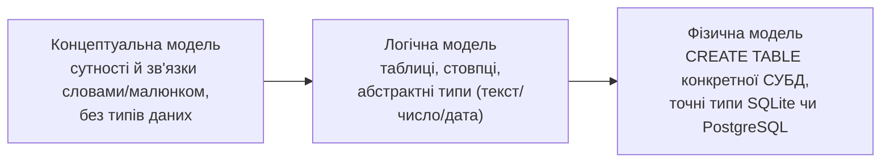
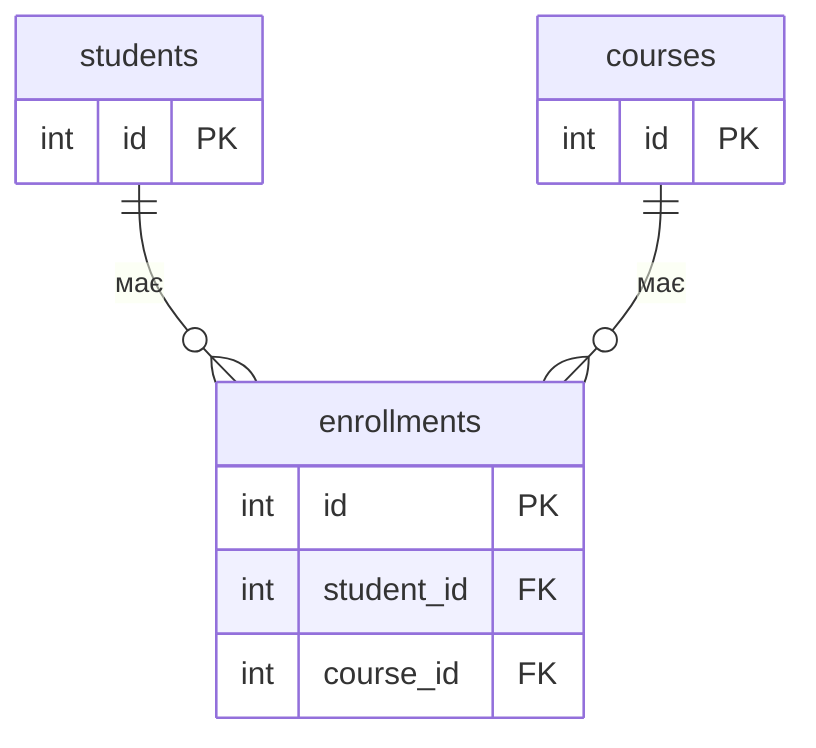
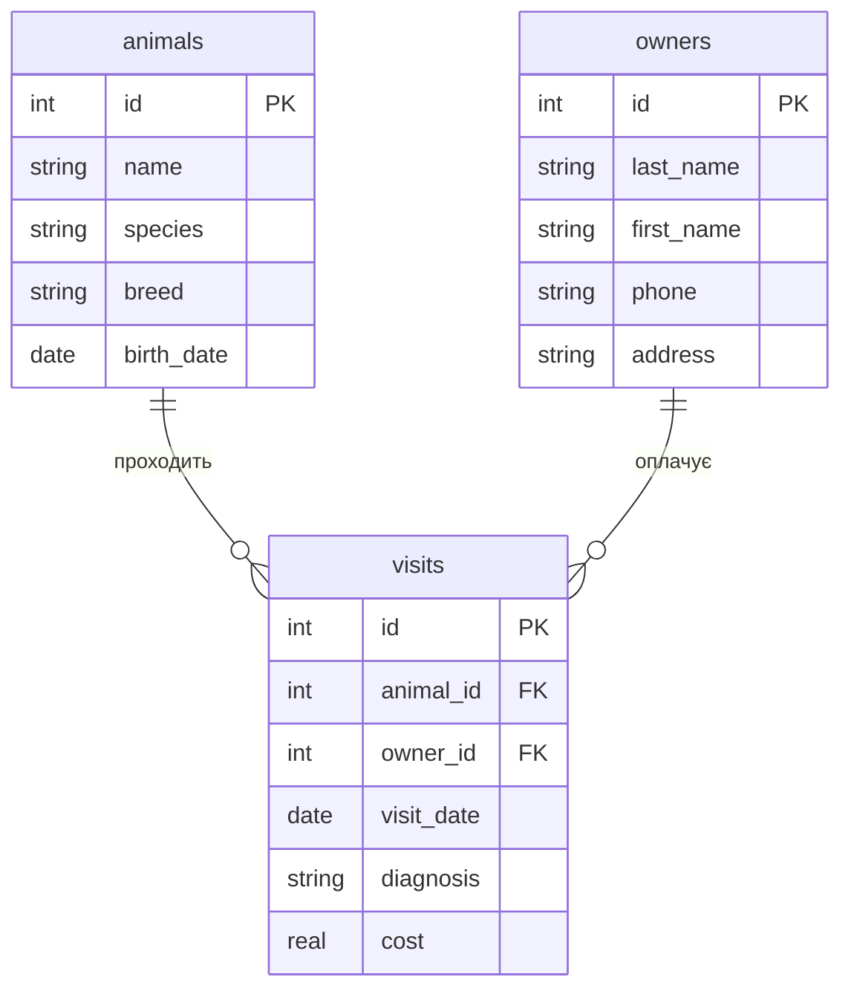

# Лекція 4. Рівні проєктування баз даних. ER-діаграми

*У Лекції 3 ми навчились отримувати дані з таблиці, яка вже існує:
`SELECT`, `WHERE`, `LIMIT` працюють з готовою структурою. Але звідки
взагалі береться ця структура — чому в таблиці саме такі стовпці, і
чому дані розкладені саме на цю кількість таблиць? Коли таблиця одна,
можна діяти інтуїтивно. Коли таблиць кілька і вони пов'язані одна з
одною (як буде вже в наступній практиці), інтуїція швидко зраджує:
легко або продублювати дані там, де мало бути посилання, або,
навпаки, спробувати "стиснути" в одну таблицю те, що насправді два
різні зв'язки. Проєктування — це етап, який відбувається **до**
першого `CREATE TABLE`, і саме йому присвячене це заняття.*

## Три рівні проєктування

Професійне проєктування бази даних проходить не одним кроком "від
задачі до SQL", а трьома послідовними рівнями деталізації. Кожен
рівень відповідає на своє питання і навмисно ігнорує деталі, які
належать наступному рівню.



**Концептуальна модель** відповідає на питання "що взагалі є в
предметній області і як воно між собою пов'язане" — без жодного
натяку на майбутні типи даних чи навіть на те, що це буде саме
реляційна база. Для бібліотеки це формулюється словами: "є книги, є
читачі, читач бере книгу на певну дату і повертає її". На цьому рівні
ще нема ані стовпця `TEXT`, ані навіть слова "таблиця" — головна
одиниця тут — **сутність**.

**Логічна модель** — той самий зміст, але вже розкладений на майбутні
таблиці й стовпці, з абстрактними типами ("текст", "ціле число",
"дата"), і **ще без прив'язки до конкретної СУБД**. На цьому рівні
можна сказати "у таблиці `books` буде стовпець `publication_year` типу
ціле число", але поки не важливо, чи це буде `INTEGER` у SQLite, чи
`INT` у PostgreSQL — обидва варіанти однаково відповідають логічній
моделі.

**Фізична модель** — конкретний SQL DDL для конкретної СУБД: точні
типи, точні обмеження, точний синтаксис. Одна й та сама логічна
таблиця "books" стає різним фізичним кодом залежно від СУБД:

```sql
-- Фізична модель для SQLite
CREATE TABLE books (
    id INTEGER PRIMARY KEY,
    title TEXT NOT NULL,
    publication_year INTEGER
);
```

```sql
-- Фізична модель того самого для PostgreSQL
CREATE TABLE books (
    id SERIAL PRIMARY KEY,
    title VARCHAR(200) NOT NULL,
    publication_year SMALLINT
);
```

**Чому не можна пропустити перші два рівні й писати `CREATE TABLE`
одразу.** Коли таблиця одна й проста, спокуса саме така — і на
Практиці 1 ми справді почали з `CREATE TABLE`, бо там була всього одна
таблиця. Але щойно в схемі з'являється друга таблиця, пов'язана з
першою, ціна помилки різко зростає: якщо неправильно визначити
кардинальність зв'язку на концептуальному рівні (наприклад, вирішити,
що "один читач бере лише одну книгу" — 1:1, коли насправді це 1:N),
доведеться переписувати вже готові `CREATE TABLE` і, гірше, вже
введені дані. Ескіз ER-діаграми на папері коштує хвилину; переробка
фізичної схеми з даними — набагато дорожча. Саме тому наступна
практика — це діаграма, а не код: спершу спроєктувати всю схему,
потім (аж у Практиці 4) її реалізувати.

## Сутності й атрибути

**Сутність (entity)** — це "іменник" предметної області: щось, про що
ми хочемо зберігати окремі записи і що згодом стане окремою таблицею.
Механіка виділення сутностей проста: перечитати опис задачі й
підкреслити іменники, які повторюються як самостійні об'єкти —
"книга", "читач", "видача" для бібліотеки; "товар", "клієнт",
"замовлення" для інтернет-магазину. Дієслова й прикметники сутностями
не стають — вони, як правило, стають зв'язками або атрибутами.

**Атрибут (attribute)** — властивість сутності, яка на логічному рівні
стане стовпцем: у сутності "книга" атрибути — назва, автор, рік
видання, жанр. Атрибут, який однозначно ідентифікує один конкретний
екземпляр сутності серед усіх інших (жодні дві книги в каталозі не
можуть мати той самий `id`), — кандидат на первинний ключ; про це
детальніше в розділі 5 нижче й повністю в Лекції 5.

## Зв'язки й кардинальність

Сутності самі по собі — лише список майбутніх таблиць. Проєктування
починається там, де ми питаємо: **як** сутності пов'язані одна з
одною і **скільки** екземплярів однієї відповідає скільком
екземплярам іншої. Це і є кардинальність зв'язку, і в реляційних
базах вона буває трьох видів.

**1:1 (один до одного).** Кожному екземпляру першої сутності
відповідає рівно один екземпляр другої, і навпаки. Приклад: "людина" і
"паспорт" — один паспорт належить рівно одній людині, одна людина має
рівно один (діючий) паспорт. На практиці 1:1 трапляється рідше, ніж
здається: часто це сигнал, що дві сутності можна об'єднати в одну
таблицю.

**1:N (один до багатьох).** Один екземпляр першої сутності
пов'язаний із багатьма екземплярами другої, але кожен екземпляр
другої — лише з одним екземпляром першої. Приклад: один читач бере
багато книг протягом року, але кожна конкретна видача книги стосується
рівно одного читача. Це найпоширеніший тип зв'язку в реляційних базах
— саме він реалізується одним зовнішнім ключем у "багатьох" таблиці.

**M:N (багато до багатьох).** Багато екземплярів першої сутності
пов'язані з багатьма екземплярами другої, і навпаки. Приклад: один
студент відвідує багато курсів, і один курс відвідують багато
студентів.

**Чому M:N — концептуальна пастка.** Здається природним спробувати
записати M:N так само, як 1:N — додати до однієї з двох таблиць
зовнішній ключ на іншу. Але це не працює: якщо додати до таблиці
`students` стовпець `course_id`, у нього можна записати лише **одне**
значення на рядок, а студент відвідує кілька курсів одночасно. Той
самий стовпець не може зберігати "3 і 7 і 12" водночас без порушення
самої ідеї реляційної колонки (одне значення — один стовпець — один
рядок). Розв'язання — **проміжна (з'єднувальна) таблиця**, яка сама не
є "справжньою" сутністю предметної області, а лише фіксує факт
конкретного зв'язку:



Проміжна таблиця `enrollments` перетворює один зв'язок M:N на два
зв'язки 1:N — і кожен з них уже прекрасно виражається звичайним
зовнішнім ключем. Це загальне правило без винятків: **будь-який
зв'язок M:N у реляційній базі завжди реалізується через окрему
таблицю з двома зовнішніми ключами**, ніколи — двома FK-колонками в
одній з основних таблиць.

## ER-діаграма як нотація

Усе сказане вище можна намалювати, а не тільки описати словами — саме
для цього існує ER-діаграма (Entity-Relationship diagram). Mermaid
підтримує її нативно через тип діаграми `erDiagram`, і саме такий код
рендериться прямо на цій сторінці сайту курсу.

Розглянемо наскрізний приклад — Ветклініку (animals, owners,
visits), яку ми будемо використовувати як демонстрацію в кількох
наступних заняттях:



Це рівно та структура, яку описує дорожня карта курсу для кожного
варіанта: дві "вимірні" таблиці (`animals`, `owners`) і одна
"фактова"/журнальна таблиця (`visits`), яка фіксує конкретну подію і
має два зовнішні ключі — по одному на кожну вимірну таблицю.

**Синтаксис позначень кардинальності.** Кожен зв'язок у `erDiagram`
записується як `СУТНІСТЬ_A позначення--позначення СУТНІСТЬ_B : "назва"`,
і позначення з обох боків читаються окремо — те, що стоїть біля
`СУТНІСТЬ_A`, описує, скільки екземплярів `СУТНІСТЬ_A` бере участь у
зв'язку з боку `СУТНІСТЬ_B` (і навпаки):

| Позначення | Значення |
|---|---|
| `\|\|` | рівно один |
| `\|o` | нуль або один |
| `\|{` / `}\|` | один або більше |
| `o{` / `}o` | нуль або більше |

Отже `animals ||--o{ visits` читається так: "рівно одна тварина
відповідає нулю або багатьом візитам" — тобто одна тварина може мати
скільки завгодно візитів (у тому числі поки що жодного), а кожен
конкретний візит стосується рівно однієї тварини. Це стандартний
запис зв'язку 1:N.

## Первинні й зовнішні ключі — коротко

Щоб зв'язок, намальований на ER-діаграмі, узагалі можна було
реалізувати в реальній таблиці, потрібні два типи спеціальних
стовпців. **Первинний ключ (PK)** — стовпець (чи набір стовпців), що
однозначно ідентифікує кожен рядок таблиці; на діаграмі вище це `id` в
кожній із трьох таблиць. **Зовнішній ключ (FK)** — стовпець, значення
якого посилається на первинний ключ **іншої** таблиці й тим самим
фізично реалізує зв'язок, намальований на ER-діаграмі лінією; на
діаграмі вище це `animal_id` і `owner_id` в таблиці `visits`. На цьому
занятті достатньо розуміти, що PK/FK — саме той механізм, який
перетворює лінії й позначення кардинальності на реальні стовпці бази
даних; детальний синтаксис `PRIMARY KEY` і `FOREIGN KEY` в SQLite,
разом із командою `INSERT`, — тема Лекції 5.

## Підсумок

- Проєктування бази даних проходить три рівні: концептуальний (сутності
  й зв'язки словами), логічний (таблиці й абстрактні типи, ще без
  СУБД) і фізичний (конкретний `CREATE TABLE` для SQLite чи
  PostgreSQL).
- Сутність — майбутня таблиця, атрибут — майбутній стовпець;
  виділяються з опису предметної області як "іменники", що повторюються
  як самостійні об'єкти.
- Зв'язки бувають трьох видів кардинальності: 1:1, 1:N і M:N — і M:N
  **завжди** вимагає окремої проміжної таблиці з двома FK, бо один
  стовпець не може зберігати кілька значень одночасно.
- Mermaid `erDiagram` — стандартна нотація для малювання ER-діаграм
  прямо в markdown, із власним синтаксисом позначень кардинальності
  (`||`, `o{`, `|{` тощо).
- PK/FK — механізм, який реалізує зв'язки з діаграми у фізичних
  таблицях; детально — в Лекції 5.

**Практика до цієї лекції:** [Практика 3. Створення ER-діаграм для заданих прикладів](../practice/03-er-modeling.md)

## Рекомендована література

Жученко А. І., Ярощук Л. Д. *Проєктування інформаційних систем: Бази даних.* — Київ: КПІ ім. Ігоря Сікорського, 2022 ([відкритий доступ](https://files.znu.edu.ua/files/Bibliobooks/Inshi83/0063533.pdf)). Розділ 5 — ER-моделювання: інфологічні моделі, нотації Чена та «Вороняча лапка» (Crow's Foot), відображення зв'язків і кардинальності.

Харів Н. О. *Бази даних та інформаційні системи.* — Рівне: НУВГП (Національний університет водного господарства та природокористування), 2018 ([відкритий доступ](https://ep3.nuwm.edu.ua/9129/3/%D0%A5%D0%B0%D1%80%D1%96%D0%B2%20%D0%9D.%D0%9E.pdf)). Теоретичний розділ — модель «сутність-зв'язок» (ER-модель) як етап проектування реляційної БД.
