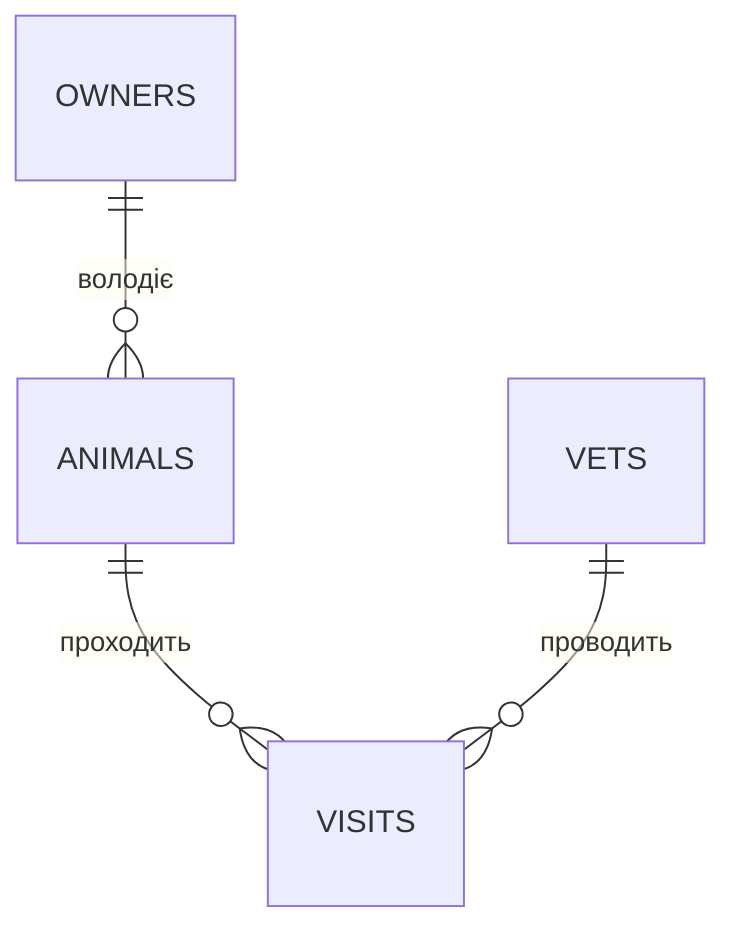

# Лекція 5. Вставка даних (INSERT). Первинні та зовнішні ключі

*У Лекції 4 ER-діаграма існувала лише на папері (чи в mermaid-схемі) —
прямокутники, лінії, кардинальність "один до багатьох". Ця лекція
перетворює той самий проєкт на реальні таблиці SQLite: як вставляти в
них дані, як гарантувати, що в кожному рядку є унікальний ідентифікатор
(первинний ключ), і як змусити СУБД технічно стежити за тим, щоб лінії
на діаграмі (зв'язки між таблицями) не порушувались (зовнішній ключ).*

## 1. Вставка рядків: INSERT INTO

Базовий синтаксис додає один рядок з явним переліком колонок:

```sql
INSERT INTO books (title, author, publication_year)
VALUES ('Кобзар', 'Тарас Шевченко', 1840);
```

SQLite дозволяє й скорочений запис без переліку колонок — значення
підставляються в тому порядку, у якому колонки описані в `CREATE
TABLE`:

```sql
INSERT INTO books VALUES (NULL, 'Кобзар', 'Тарас Шевченко', 1840, 'поезія', 3);
```

**Чому явний перелік колонок — безпечніша звичка.** Скорочений запис
працює, доки схема таблиці не змінюється. Щойно хтось додає нову
колонку через `ALTER TABLE` (Лекція 17) або переставляє порядок при
перестворенні таблиці, кожен старий `INSERT` без переліку колонок або
впаде з помилкою (не збігається кількість значень), або, що гірше,
мовчки запише значення в неправильні колонки. Явний перелік колонок
незалежний від порядку й від того, чи з'явилась нова колонка — це
головна причина, чому в реальному коді скорочений варіант практично не
використовують.

Кілька рядків вставляються однією командою — через кому в `VALUES`,
без повторення `INSERT INTO`:

```sql
INSERT INTO books (title, author, publication_year, genre, copies_count)
VALUES
    ('Тигролови', 'Іван Багряний', 1944, 'пригоди', 2),
    ('Захар Беркут', 'Іван Франко', 1883, 'історична проза', 4),
    ('Земля', 'Ольга Кобилянська', 1902, 'проза', 2);
```

Це не лише коротший запис: СУБД обробляє групу рядків як одну операцію,
що для великих обсягів даних (Лекція 16, імпорт CSV) помітно швидше за
серію окремих `INSERT`.

## 2. Первинний ключ (PRIMARY KEY)

`PRIMARY KEY` позначає колонку (чи набір колонок), яка унікально
ідентифікує рядок у таблиці: значення не повторюється і не може бути
`NULL`. Це технічна опора, на якій тримається все, що прийде далі —
`JOIN` (Лекція 7) з'єднує таблиці саме через збіг значення первинного
ключа однієї таблиці зі значенням в іншій.

```sql
CREATE TABLE books (
    id INTEGER PRIMARY KEY,
    title TEXT NOT NULL,
    author TEXT,
    publication_year INTEGER,
    genre TEXT,
    copies_count INTEGER NOT NULL DEFAULT 1
);
```

**Особливість SQLite, яку варто знати заздалегідь.** У більшості СУБД
автоінкремент первинного ключа потрібно вмикати явно. У SQLite колонка,
оголошена рівно як `INTEGER PRIMARY KEY` (тип — одне слово `INTEGER`,
без варіацій типу `INT` чи `BIGINT`), стає **псевдонімом вбудованого
`rowid`** — внутрішнього номера рядка, який СУБД веде для кожної
таблиці незалежно. Завдяки цьому:

- якщо не передати значення `id` при `INSERT` (або передати `NULL`),
  SQLite саме підставить `максимум наявних id + 1` — автоінкремент
  працює "з коробки", без ключового слова `AUTOINCREMENT`;
- ключове слово `AUTOINCREMENT` (`INTEGER PRIMARY KEY AUTOINCREMENT`)
  існує окремо і робить вужчу річ: гарантує, що номер видаленого рядка
  ніколи не буде використаний повторно (СУБД веде для цього додаткову
  системну таблицю `sqlite_sequence`), за рахунок трохи повільнішої
  вставки. Для навчальної бази це зазвичай не потрібно — звичайного
  `INTEGER PRIMARY KEY` достатньо.

## 3. Зовнішній ключ (FOREIGN KEY) і зв'язки між таблицями

`FOREIGN KEY` — колонка в одній таблиці, значення якої зобов'язане
збігатися з існуючим значенням первинного ключа іншої таблиці (або
бути `NULL`, якщо колонка це дозволяє). Механічно це і є той самий
зв'язок "один до багатьох" з ER-діаграми Лекції 4, тільки записаний
мовою SQL: таблиця "багато" зберігає в собі значення ключа таблиці
"один".

```sql
-- фрагмент схеми: припускаємо, що таблиця owners вже створена нижче
CREATE TABLE animals (
    id INTEGER PRIMARY KEY,
    name TEXT NOT NULL,
    species TEXT,
    age INTEGER,
    owner_id INTEGER NOT NULL,
    FOREIGN KEY (owner_id) REFERENCES owners (id)
);
```

**Критична деталь, яку новачки постійно пропускають.** У SQLite
перевірка зовнішніх ключів **вимкнена за замовчуванням** — з
історичних причин сумісності. Оголошення `FOREIGN KEY ... REFERENCES
...` у `CREATE TABLE` саме по собі нічого не забороняє: без додаткової
команди можна спокійно вставити рядок із `owner_id`, якого не існує в
таблиці `owners`, і SQLite це мовчки прийме. Перевірку потрібно
включати на **кожному новому з'єднанні** з базою:

```sql
PRAGMA foreign_keys = ON;
```

Це не разова настройка файлу бази, а параметр сесії: якщо відкрити той
самий файл `.db` в іншій програмі чи новому підключенні й не виконати
`PRAGMA foreign_keys = ON;` там знову, перевірка знову буде вимкнена —
навіть якщо вона щойно спрацьовувала в попередньому сеансі.

## 4. Реалізація зв'язку 1:N: ветклініка

Зберемо фрагмент вище в повний робочий скрипт: спершу таблицю
`owners`, потім `animals` з `FOREIGN KEY` на неї — рівно той зв'язок
"один власник → багато тварин", який на ER-діаграмі Лекції 4
позначався лінією `||--o{`.

```sql
PRAGMA foreign_keys = ON;

CREATE TABLE owners (
    id INTEGER PRIMARY KEY,
    last_name TEXT NOT NULL,
    first_name TEXT NOT NULL,
    phone TEXT
);

CREATE TABLE animals (
    id INTEGER PRIMARY KEY,
    name TEXT NOT NULL,
    species TEXT,
    age INTEGER,
    owner_id INTEGER NOT NULL,
    FOREIGN KEY (owner_id) REFERENCES owners (id)
);

INSERT INTO owners (last_name, first_name, phone) VALUES
    ('Мельник', 'Ганна', '0671234567'),
    ('Бондар', 'Ігор', '0501234567');

INSERT INTO animals (name, species, age, owner_id) VALUES
    ('Мурчик', 'кіт', 3, 1),
    ('Рекс', 'пес', 5, 2);
```

Тепер додамо другу таблицю-вимірювання (`vets`) і фактову
таблицю (`visits`) з **двома** зовнішніми ключами — саме цей крок
Практика 4 повторює на власному варіанті бази:

```sql
CREATE TABLE vets (
    id INTEGER PRIMARY KEY,
    name TEXT NOT NULL,
    specialization TEXT
);

CREATE TABLE visits (
    id INTEGER PRIMARY KEY,
    animal_id INTEGER NOT NULL,
    vet_id INTEGER NOT NULL,
    visit_date TEXT NOT NULL,
    diagnosis TEXT,
    FOREIGN KEY (animal_id) REFERENCES animals (id),
    FOREIGN KEY (vet_id) REFERENCES vets (id)
);

INSERT INTO vets (name, specialization) VALUES
    ('Савчук Олег', 'терапія'),
    ('Литвин Марія', 'хірургія');

INSERT INTO visits (animal_id, vet_id, visit_date, diagnosis) VALUES
    (1, 1, '2026-08-10', 'плановий огляд'),
    (2, 2, '2026-08-12', 'вакцинація');
```



Три FK-зв'язки на діаграмі — три `FOREIGN KEY ... REFERENCES` у коді
вище. Схема, яку в Лекції 4 було лише намальовано, тут стала робочою
базою: спробувати вставити `visits` з `vet_id`, якого не існує в
`vets`, тепер технічно неможливо — завдяки `PRAGMA foreign_keys
= ON`.

## 5. ON DELETE / ON UPDATE: що робити зі "своїми" при видаленні "чужого"

`FOREIGN KEY` можна доповнити правилом, яке автоматично виконується,
коли рядок, на який посилається ключ, видаляється (`ON DELETE`) або
змінюється його первинний ключ (`ON UPDATE`):

```sql
FOREIGN KEY (owner_id) REFERENCES owners (id) ON DELETE RESTRICT
```

- **`RESTRICT`** (і поведінка за замовчуванням, коли дію взагалі не
  вказано, — формально `NO ACTION`, але для звичайного,
  недвідкладеного режиму на практиці працює так само) — забороняє
  видалення батьківського рядка, доки на нього є хоч одне посилання.
  СУБД просто відмовить у видаленні `owners`, поки в `animals` є
  рядок з таким `owner_id`.
- **`SET NULL`** — при видаленні батьківського рядка залежна колонка
  обнуляється (`owner_id` стає `NULL`). Потребує, щоб колонка дозволяла
  `NULL` (без `NOT NULL`).
- **`CASCADE`** — видалення батьківського рядка автоматично видаляє й
  усі залежні рядки.

**Чому вибір дії — рішення про бізнес-логіку, а не техніка.** У
ветклініці видалення власника (наприклад, клієнт офіційно припинив
обслуговування) **не повинно** автоматично стерти всю історію візитів
його тварин — медичні записи мають зберігатись незалежно від того, чи
власник досі клієнт. Тому для зв'язку `animals → owners` доречний
`RESTRICT` (не дати видалити власника, поки за ним є тварини — спершу
свідомо перепризначити чи архівувати тварин) або `SET NULL` (дозволити
видалення, але позначити тварину як "без активного власника"), тоді як
`CASCADE` тут — типова помилка початківця: технічно зручно, але
знищує дані, які могли бути потрібні.

## Підсумок

- `INSERT INTO таблиця (колонки) VALUES (...), (...), ...` додає один
  або кілька рядків одночасно; явний перелік колонок стійкіший до
  майбутніх змін схеми, ніж скорочений запис.
- `PRIMARY KEY` унікально ідентифікує рядок; `INTEGER PRIMARY KEY` у
  SQLite — особливий випадок, псевдонім `rowid` з автоінкрементом без
  явного `AUTOINCREMENT`.
- `FOREIGN KEY ... REFERENCES ...` технічно закріплює зв'язок з
  ER-діаграми, але лише після `PRAGMA foreign_keys = ON;` — без цієї
  команди на поточному з'єднанні перевірка мовчки не працює.
- `ON DELETE`/`ON UPDATE` (`RESTRICT`, `SET NULL`, `CASCADE`) визначають
  долю залежних рядків при видаленні батьківського — вибір завжди
  залежить від бізнес-сенсу даних, а не лише від синтаксису.


## Типові помилки

**Забути `PRAGMA foreign_keys = ON;` після відкриття нового
з'єднання.** Це найпоширеніша помилка з усієї теми: `FOREIGN KEY`
оголошений у `CREATE TABLE`, тести проходили в одному сеансі, а в
іншому — раптом вставляються "неправильні" дані без жодної помилки,
бо PRAGMA потрібно виконувати щоразу.

**Плутати `PRIMARY KEY` і `FOREIGN KEY` — вважати їх взаємозамінними
поняттями.** Первинний ключ ідентифікує рядок **своєї** таблиці;
зовнішній ключ — посилання **на чужий** первинний ключ. Одна колонка
технічно може бути одночасно і зовнішнім ключем, і частиною первинного
ключа своєї таблиці, але це різні ролі, не синоніми.

**Обирати `CASCADE` за замовчуванням, "бо простіше".** `CASCADE`
доречний лише там, де залежні рядки справді втрачають сенс без
батьківського (наприклад, позиції конкретного замовлення без самого
замовлення) — не там, де вони являють собою самостійну історичну
цінність.

**Практика до цієї лекції:** [Практика 4. Додавання записів, встановлення ключів і зв'язків](../practice/04-insert-keys.md)

## Рекомендована література

Ужгородський національний університет, інженерно-технічний факультет (уклад.). *Організація баз даних: Робота з базами даних. Методичні вказівки і завдання до лабораторних робіт.* — Ужгород: ДВНЗ «Ужгородський національний університет», 2021 ([відкритий доступ](https://www.uzhnu.edu.ua/en/infocentre/get/42933)). Лабораторна робота 3 — створення БД у СУБД (CREATE DATABASE, CREATE TABLE), первинні (PRIMARY KEY) та зовнішні (FOREIGN KEY) ключі, зв'язки таблиць.

Павловський В. І., Петрашенко А. В. *Бази даних та засоби управління.* — Київ: КПІ ім. Ігоря Сікорського, 2024 ([відкритий доступ](https://ela.kpi.ua/bitstreams/9f26675d-c42f-485e-aab5-13e6e014b560/download)). Розділ про реляційну модель і нормалізацію — роль первинних і зовнішніх ключів; INSERT у контексті SQL-мови.
