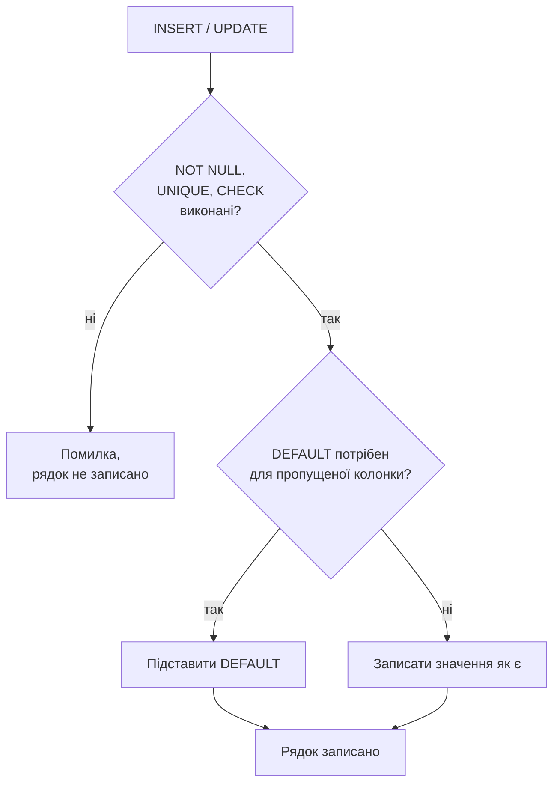
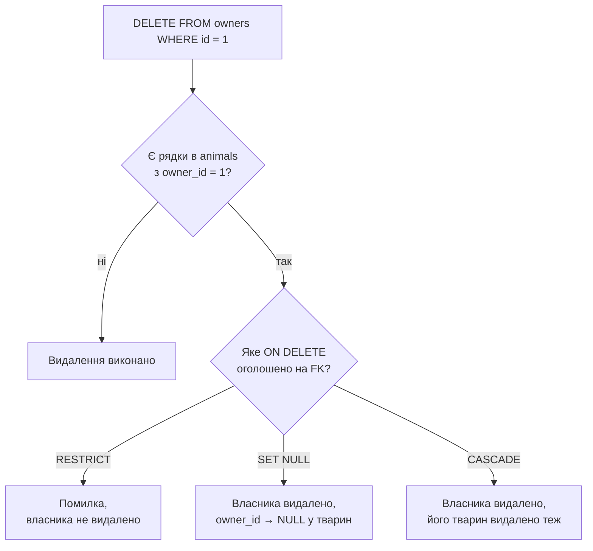

# Лекція 6. Обмеження цілісності даних (NOT NULL, UNIQUE, CHECK, DEFAULT) та оновлення й видалення записів (UPDATE, DELETE)

*Лекція 5 закріпила один тип цілісності — зв'язки між таблицями через
`FOREIGN KEY`, і одразу зроблено застереження: ця перевірка технічно
вимкнена, доки не виконано `PRAGMA foreign_keys = ON;`. Сьогоднішні
чотири обмеження — інша річ: вони діють **всередині однієї таблиці**,
не залежать від жодної PRAGMA і перевіряються SQLite завжди, без
винятків. А в другій частині лекції ті самі рядки, які ми навчимося
правильно вставляти, ми навчимося ще й змінювати та видаляти.*

## 0. Чому це не той самий випадок, що FOREIGN KEY

Коротке, але важливе уточнення одразу на початку: `NOT NULL`, `UNIQUE`,
`CHECK` і `DEFAULT` — це базові обмеження стандарту SQL, і SQLite
перевіряє їх безумовно, на кожному `INSERT` і `UPDATE`, з першого дня
роботи бази. Немає жодного перемикача, який їх вимикає (на відміну від
`PRAGMA foreign_keys`). Якщо рядок порушує будь-яке з них, SQLite
відмовляє у виконанні всієї команди — жоден рядок не потрапляє в
таблицю частково.

## 1. NOT NULL — обов'язкове значення

`NOT NULL` вже з'являвся побіжно в прикладах Лекцій 2 і 5 — тепер
зафіксуємо це формально: колонка з таким обмеженням не може лишитися
без значення. Спроба вставити `NULL` (явно чи пропустивши колонку без
`DEFAULT`) завершується помилкою:

```sql
INSERT INTO owners (last_name, phone) VALUES ('Мельник', '0671234567');
-- Runtime error: NOT NULL constraint failed: owners.first_name
```

Колонку `first_name` тут просто не передали — і, оскільки вона оголошена
`NOT NULL`, а `DEFAULT` для неї не задано, SQLite не має чим її
заповнити і зупиняє вставку повністю, а не лише цієї колонки.

## 2. UNIQUE — значення не повторюється

`UNIQUE` гарантує, що в колонці (чи наборі колонок) не буде двох
однакових значень серед усіх рядків таблиці — на відміну від
`PRIMARY KEY`, який теж унікальний, але один на таблицю і не допускає
`NULL`. `UNIQUE`-колонок може бути кілька, і, на відміну від
`PRIMARY KEY`, вона **дозволяє** `NULL` — причому одразу декільком
рядкам, бо, за логікою трьохзначної логіки з Лекції 3, `NULL` ніколи не
вважається рівним іншому `NULL`, тож два `NULL` не порушують унікальність:

```sql
phone TEXT NOT NULL UNIQUE,
email TEXT UNIQUE
```

`UNIQUE` можна оголосити і на **комбінації** кількох колонок разом —
тоді унікальним має бути саме поєднання значень, а не кожна колонка
окремо:

```sql
UNIQUE (owner_id, name)
```

Це означає: у одного власника не може бути двох тварин з однаковим
ім'ям, але тварини з іменем "Мурчик" у **різних** власників — це вже
не порушення, бо пара `(owner_id, name)` в кожному з двох рядків різна.

## 3. DEFAULT — значення, якщо не вказано інше

`DEFAULT` задає значення, яке SQLite підставить автоматично, якщо
`INSERT` не передав колонку явно. Приклад уже траплявся в Лекції 5:

```sql
copies_count INTEGER NOT NULL DEFAULT 1
```

Якщо `INSERT` не згадує `copies_count`, туди піде `1`, а не
`NULL` — і саме тому таке поєднання (`NOT NULL DEFAULT ...`) працює:
`DEFAULT` гарантує, що значення завжди буде, тож `NOT NULL` ніколи не
зірветься через просто забуту колонку.

## 4. CHECK — довільна умова на значення

`CHECK` — найгнучкіше з чотирьох: довільний булевий вираз, який SQLite
обчислює для кожного рядка при `INSERT`/`UPDATE`. Якщо вираз дає
`FALSE`, вставка чи оновлення відмовляється:

```sql
age INTEGER CHECK (age >= 0)
```

**Чим це відрізняється від типу колонки.** Type affinity з Лекції 2
контролює лише *вид* значення (число проти тексту), а не його
допустимий діапазон: `INTEGER` однаково спокійно прийме і `5`, і `-5`.
`CHECK` — саме той інструмент, який додає межі значення, які affinity
принципово не може перевірити.

## 5. Повний приклад: ветклініка з усіма чотирма обмеженнями

```sql
CREATE TABLE owners (
    id         INTEGER PRIMARY KEY,
    last_name  TEXT NOT NULL,
    first_name TEXT NOT NULL,
    phone      TEXT NOT NULL UNIQUE,
    email      TEXT UNIQUE
);

CREATE TABLE animals (
    id        INTEGER PRIMARY KEY,
    name      TEXT NOT NULL,
    species   TEXT NOT NULL,
    age       INTEGER CHECK (age >= 0),
    status    TEXT NOT NULL DEFAULT 'на обліку',
    owner_id  INTEGER NOT NULL,
    FOREIGN KEY (owner_id) REFERENCES owners (id),
    UNIQUE (owner_id, name)
);
```

Три спроби, які покажуть кожне обмеження в дії:

```sql
-- порушення UNIQUE (телефон уже є в базі)
INSERT INTO owners (last_name, first_name, phone) VALUES ('Бондар', 'Ігор', '0671234567');
-- Runtime error: UNIQUE constraint failed: owners.phone

-- порушення CHECK
INSERT INTO animals (name, species, age, owner_id) VALUES ('Кіко', 'папуга', -2, 1);
-- Runtime error: CHECK constraint failed: age >= 0

-- DEFAULT спрацьовує мовчки, без помилки
INSERT INTO animals (name, species, age, owner_id) VALUES ('Барсик', 'кіт', 3, 1);
SELECT status FROM animals WHERE name = 'Барсик';
-- на обліку
```



Досі кожен приклад лише **додавав** рядки. Далі в цій самій лекції —
про протилежну дію: як змінювати й видаляти те, що вже записано в
таблиці, і що з щойно розглянутими обмеженнями цілісності відбувається
саме в цей момент.

## 6. UPDATE: зміна існуючих рядків

```sql
UPDATE animals
SET age = 4
WHERE name = 'Мурчик';
```

`SET` перелічує, які колонки й на які нові значення змінити; `WHERE`
визначає, **яких** рядків це стосується — синтаксично той самий
`WHERE`, що й у `SELECT` з Лекції 3, з тими самими операторами
порівняння.

**Найважливіше попередження цієї теми.** `WHERE` в `UPDATE` —
необов'язковий синтаксично, але його відсутність означає: змінити
**всі** рядки таблиці одночасно.

```sql
-- оновлює вік УСІХ тварин у таблиці, а не тільки Мурчика
UPDATE animals SET age = 4;
```

Це не помилка синтаксису — SQLite виконає команду точно так, як
написано, без попередження. Перш ніж натиснути Enter на `UPDATE`,
завжди варто спершу подумки (або реальним `SELECT` з тим самим
`WHERE`) перевірити, скільки саме рядків підпадає під умову.

Кілька колонок оновлюються однією командою через кому:

```sql
UPDATE animals
SET age = age + 1, status = 'на обліку'
WHERE owner_id = 1;
```

Вираз `age = age + 1` показує ключову властивість `SET`: праворуч від
`=` можна використати **поточне** значення тієї самої колонки — новий
вік обчислюється на основі старого, а не задається наперед відомим
числом.

**Обмеження цілісності, розглянуті вище, діють і тут.** Спроба
`UPDATE`, яка порушує `CHECK`, `UNIQUE` чи `NOT NULL`, відмовляється
точно так само, як і порушений `INSERT`:

```sql
UPDATE animals SET age = -1 WHERE name = 'Мурчик';
-- Runtime error: CHECK constraint failed: age >= 0
```

## 7. DELETE: видалення рядків

```sql
DELETE FROM animals
WHERE name = 'Кіко';
```

`DELETE FROM таблиця WHERE умова` стирає рядки, що задовольняють умову,
повністю — на відміну від `UPDATE`, тут немає `SET`, бо видаляється
весь рядок, а не окрема колонка. І те саме попередження, ще гостріше:

```sql
-- видаляє геть усі рядки з animals
DELETE FROM animals;
```

Без `WHERE` це видаляє все, і, на відміну від помилки типу чи
обмеження, тут немає ніякого повідомлення, яке зупинило б виконання —
дані просто зникають. Це одна з причин, чому реальні бази регулярно
резервно копіюють: `DELETE` без `WHERE` (чи з надто широкою умовою) —
не рідкість серед типових інцидентів втрати даних.

## 8. DELETE і зовнішні ключі: коли Лекція 5 повертається

`DELETE` з "батьківської" таблиці — тієї, на яку посилається
`FOREIGN KEY` з іншої таблиці — це саме той момент, коли на практиці
спрацьовує правило `ON DELETE`, обране в Лекції 5:

```sql
DELETE FROM owners WHERE id = 1;
```

Якщо для `animals.owner_id` було оголошено `ON DELETE RESTRICT` (як і
рекомендувала Лекція 5 для ветклініки), ця команда завершиться
помилкою, доки в `animals` лишається хоч один рядок з `owner_id = 1`:

```
Runtime error: FOREIGN KEY constraint failed
```

Якби замість `RESTRICT` було обрано `SET NULL`, ця сама команда
виконалася б, а всі відповідні `owner_id` в `animals` стали б `NULL`;
при `CASCADE` — видалення власника видалило б і всіх його тварин.
Один і той самий `DELETE`, три принципово різні наслідки — залежно від
рішення, ухваленого ще на етапі `CREATE TABLE`.



## Підсумок

- `NOT NULL`, `UNIQUE`, `CHECK` і `DEFAULT` діють у межах однієї
  таблиці й перевіряються SQLite завжди — на відміну від `FOREIGN KEY`,
  який залежить від `PRAGMA foreign_keys`.
- `UNIQUE` (на відміну від `PRIMARY KEY`) дозволяє кілька `NULL` і може
  охоплювати комбінацію колонок, а не лише одну.
- `DEFAULT` підставляє значення при пропущеній колонці — і часто
  працює в парі з `NOT NULL`, щоб пропуск ніколи не призводив до
  помилки.
- `CHECK` перевіряє довільну умову на значення — там, де сам тип
  колонки (type affinity) нічого не обмежує, окрім виду даних.
- `UPDATE таблиця SET колонка = значення, ... WHERE умова` змінює
  існуючі рядки; вираз праворуч від `=` може посилатися на поточне
  значення тієї самої колонки.
- `DELETE FROM таблиця WHERE умова` видаляє рядки повністю, без
  часткового видалення окремих колонок.
- Відсутність `WHERE` в обох командах означає "усі рядки" — це
  найпоширеніша й найдорожча помилка теми; перевіряти умову `SELECT`-ом
  заздалегідь — гарна звичка.
- `DELETE` з таблиці, на яку посилається `FOREIGN KEY`, підпорядковане
  правилу `ON DELETE`, обраному при `CREATE TABLE` (Лекція 5):
  `RESTRICT` забороняє, `SET NULL` обнуляє посилання, `CASCADE` тягне
  видалення далі.

**Практика до цієї лекції:** [Практика 5. Обмеження цілісності даних: NOT NULL, UNIQUE, CHECK, DEFAULT](../practice/05-constraints.md); [Практика 6. Робота з командами оновлення та видалення у SQLite](../practice/06-update-delete.md)

## Рекомендована література

Павловський В. І., Петрашенко А. В. *Бази даних та засоби управління.* — Київ: КПІ ім. Ігоря Сікорського, 2024 ([відкритий доступ](https://ela.kpi.ua/bitstreams/9f26675d-c42f-485e-aab5-13e6e014b560/download)). Розділ про реляційну модель — обмеження цілісності при проектуванні таблиць.

Ахромов М. О. *Конспект лекцій з дисциплін «Бази даних», «Організація баз даних та знань».* — Краматорськ: Машинобудівний коледж Донбаської державної машинобудівної академії (МК ДДМА), 2018 ([відкритий доступ](https://files.znu.edu.ua/files/Bibliobooks/Inshi77/0057074.pdf)). Розділ «реляційна теорія» — правила Кодда, обмеження цілісності сутностей і посилань, первинні/зовнішні ключі (загальна теорія, застосовна до CHECK/NOT NULL/UNIQUE/FK).

Ужгородський національний університет, інженерно-технічний факультет (уклад.). *Організація баз даних: Робота з базами даних. Методичні вказівки і завдання до лабораторних робіт.* — Ужгород: ДВНЗ «Ужгородський національний університет», 2021 ([відкритий доступ](https://www.uzhnu.edu.ua/en/infocentre/get/42933)). Лабораторні роботи 2 та 4 — оператори модифікації даних INSERT/UPDATE/DELETE.

Харів Н. О. *Бази даних та інформаційні системи.* — Рівне: НУВГП (Національний університет водного господарства та природокористування), 2018 ([відкритий доступ](https://ep3.nuwm.edu.ua/9129/3/%D0%A5%D0%B0%D1%80%D1%96%D0%B2%20%D0%9D.%D0%9E.pdf)). Розділ SQL — мова маніпулювання даними (DML), приклади UPDATE/DELETE.
