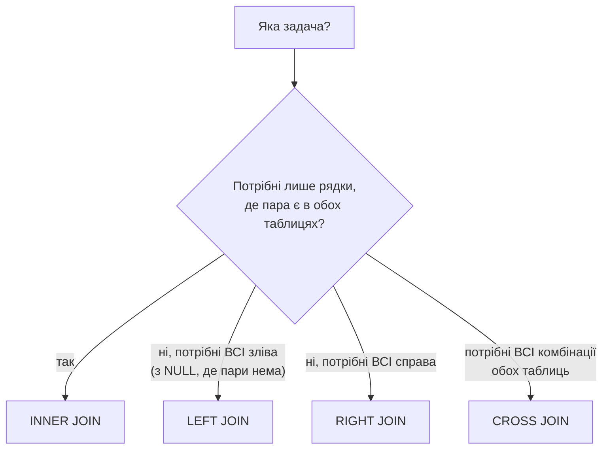

# Лекція 7. Об'єднання таблиць: INNER, LEFT, RIGHT, CROSS JOIN

*Досі кожен `SELECT` читав рядки лише з однієї таблиці. Але дані
навмисно розкладені по трьох-чотирьох таблицях саме для того, щоб
уникнути дублювання (Лекція 1) — тому й повноцінна відповідь на
питання ("хто власник цієї тварини", "який лікар оглядав цю тварину")
завжди вимагає об'єднати рядки з кількох таблиць одночасно. Саме це
робить `JOIN`.*

## 1. INNER JOIN: лише рядки, що співпали в обох таблицях

```sql
SELECT animals.name, owners.last_name
FROM animals
INNER JOIN owners ON animals.owner_id = owners.id;
```

`ON` задає умову співпадіння — синтаксично схожу на `WHERE`, але саме
вона визначає, **які пари рядків** із двох таблиць з'єднати в один
результат. `INNER JOIN` (можна писати просто `JOIN` — `INNER`
необов'язковий) лишає в результаті тільки ті пари, де умова істинна:
тварина без власника (за схемою ветклініки — неможливо, `owner_id NOT
NULL`) чи власник без жодної тварини **зникають** із результату
повністю.

Саме це "зникають" — головна пастка `INNER JOIN`, яку варто побачити
одразу:

```sql
INSERT INTO owners (last_name, first_name, phone) VALUES ('Гнатюк', 'Роман', '0671112200');
-- у нового власника поки що немає жодної тварини

SELECT owners.last_name, animals.name
FROM owners
INNER JOIN animals ON animals.owner_id = owners.id;
-- Гнатюк у результаті НЕ з'явиться — жодного рядка тварини з owner_id
-- на нього немає, а INNER JOIN показує лише пари
```

## 2. LEFT JOIN: усі рядки лівої таблиці, навіть без пари

Якщо потрібен звіт "усі власники, і їхні тварини, якщо є" — тобто
власники без тварин теж мають з'явитися — потрібен `LEFT JOIN`:

```sql
SELECT owners.last_name, animals.name
FROM owners
LEFT JOIN animals ON animals.owner_id = owners.id;
-- Гнатюк тут Є, а animals.name для нього — NULL
```

`LEFT JOIN` бере **всі** рядки лівої (першої за `FROM`) таблиці; там,
де пари з правої не знайшлось, стовпці правої таблиці заповнюються
`NULL`, а не зникає весь рядок. Це основа поширеного прийому "знайти
рядки без пари": `LEFT JOIN` + `WHERE right_table.id IS NULL`
— знайти власників, у яких **немає жодної** тварини.



## 3. RIGHT JOIN: те саме, що LEFT, але дзеркально

```sql
SELECT owners.last_name, animals.name
FROM animals
RIGHT JOIN owners ON animals.owner_id = owners.id;
-- той самий результат, що LEFT JOIN із переставленими місцями таблицями
```

`RIGHT JOIN` бере всі рядки **правої** таблиці; результат симетричний
`LEFT JOIN` із поміненими місцями `FROM`/`JOIN`-таблиць. SQLite
підтримує `RIGHT JOIN` (і `FULL OUTER JOIN`) починаючи з версії 3.39
(2022) — у сучасних збірках CLI й DB Browser це вже норма, а не
рідкість. І все ж на практиці частіше пишуть саме `LEFT JOIN`,
переставляючи таблиці місцями замість `RIGHT JOIN`, — просто за
звичкою (і для сумісності з СУБД, де `RIGHT JOIN` довше не було
взагалі); обидва варіанти правильні, це питання стилю, не коректності.

## 4. CROSS JOIN: усі можливі комбінації — і пастка, як його отримати випадково

```sql
SELECT rooms.type, 'Пн' AS день
FROM rooms
CROSS JOIN (SELECT 'Пн' UNION SELECT 'Вт' UNION SELECT 'Ср') AS дні;
-- кожен номер із кожним днем — таблиця зайнятості на тиждень наперед
```

`CROSS JOIN` — декартів добуток: кожен рядок лівої таблиці з'єднується
з **кожним** рядком правої, без жодної умови `ON`. Явно він
трапляється рідко (побудова сітки "усі номери × усі дні" — один із
небагатьох реальних прикладів). Набагато частіше `CROSS JOIN`
трапляється **випадково** — старий синтаксис `FROM a, b` (кома замість
`JOIN`) без `WHERE`, що зв'язує таблиці, є буквально тим самим
`CROSS JOIN`:

```sql
-- пастка: забули умову зв'язку — це неявний CROSS JOIN
SELECT animals.name, owners.last_name FROM animals, owners;
-- результат: КОЖНА тварина з КОЖНИМ власником (добуток кількостей рядків),
-- а не тільки реальні пари власник-тварина
```

Саме тому в цьому курсі й надалі варто писати `JOIN ... ON` явно, а не
старий кома-синтаксис: явний `JOIN` без `ON` — синтаксична помилка,
тож забута умова зв'язку одразу видно, а не мовчки псує результат
рядками, яких не мало бути.

## 5. Об'єднання трьох і більше таблиць

`JOIN` можна писати ланцюжком — кожен наступний `JOIN` додає ще одну
таблицю до вже об'єднаного результату:

```sql
SELECT
    visits.visit_date,
    animals.name AS тварина,
    owners.last_name AS власник,
    vets.name AS лікар
FROM visits
JOIN animals ON visits.animal_id = animals.id
JOIN owners ON animals.owner_id = owners.id
JOIN vets ON visits.vet_id = vets.id;
```

Кожен `JOIN` тут з'єднує рядок `visits` ще з однією таблицею через
свій власний зовнішній ключ — `visits` напряму пов'язана і з
`animals`, і з `vets` (Лекція 5), а `owners` приєднується вже
не до `visits`, а до щойно приєднаної `animals`. Порядок `JOIN` у
запиті може бути будь-яким, доки кожна умова `ON` посилається на
таблиці, що вже "в грі" на цьому кроці.

## Підсумок

- `INNER JOIN` (= просто `JOIN`) лишає тільки пари рядків, де умова
  `ON` істинна в обох таблицях; рядки без пари зникають повністю.
- `LEFT JOIN` бере всі рядки лівої таблиці; де пари немає — `NULL`
  замість стовпців правої таблиці. Основа прийому "знайти рядки без
  пари" (`LEFT JOIN` + `WHERE ... IS NULL`).
- `RIGHT JOIN` — те саме, дзеркально для правої таблиці; доступний у
  SQLite з версії 3.39.
- `CROSS JOIN` — декартів добуток усіх комбінацій; трапляється і
  випадково (старий кома-синтаксис `FROM a, b` без `WHERE`) — тому
  варто завжди писати явний `JOIN ... ON`.
- `JOIN` можна об'єднувати ланцюжком для трьох і більше таблиць — кожен
  наступний `ON` посилається на будь-яку з уже приєднаних таблиць.

**Практика до цієї лекції:** [Практика 7. Запити з різними видами об'єднання таблиць у SQLite](../practice/07-joins.md)

## Рекомендована література

Ужгородський національний університет, інженерно-технічний факультет (уклад.). *Організація баз даних: Робота з базами даних. Методичні вказівки і завдання до лабораторних робіт.* — Ужгород: ДВНЗ «Ужгородський національний університет», 2021 ([відкритий доступ](https://www.uzhnu.edu.ua/en/infocentre/get/42933)). Лабораторна робота 4 — запити на вибірку даних із кількох пов'язаних таблиць (з'єднання, JOIN).

Харів Н. О. *Бази даних та інформаційні системи.* — Рівне: НУВГП (Національний університет водного господарства та природокористування), 2018 ([відкритий доступ](https://ep3.nuwm.edu.ua/9129/3/%D0%A5%D0%B0%D1%80%D1%96%D0%B2%20%D0%9D.%D0%9E.pdf)). Розділ про зв'язки між таблицями та багатотабличні запити (JOIN).
