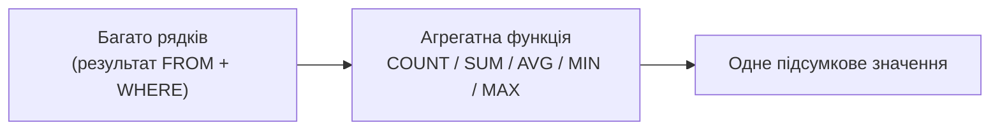

# Лекція 8. Агрегатні функції: AVG, COUNT, MIN, MAX, SUM

*Досі кожен рядок результату відповідав одному рядку таблиці (чи
поєднанню рядків після `JOIN`). Агрегатні функції — перший інструмент,
що робить інакше: замість "рядок за рядком" вони згортають **багато**
рядків у **одне** підсумкове значення — "скільки всього тварин?",
"яка середня вартість візиту?", "скільки років наймолодшій тварині?".*

## 1. Що таке агрегатна функція

```sql
SELECT COUNT(*) FROM animals;
-- одне число: скільки всього рядків у animals
```

На відміну від звичайного `SELECT id, name FROM animals`, який повертає
стільки рядків результату, скільки рядків у таблиці, агрегатна функція
бере **всі** рядки, що потрапили під `WHERE` (чи всю таблицю, якщо
`WHERE` немає), і повертає **один** рядок результату. SQLite (як і
більшість СУБД) має п'ять базових агрегатних функцій: `COUNT`, `SUM`,
`AVG`, `MIN`, `MAX`.

## 2. COUNT: скільки рядків

```sql
SELECT COUNT(*) FROM animals;
-- усі рядки, включно з тими, де якісь колонки NULL

SELECT COUNT(owner_id) FROM animals;
-- лише рядки, де owner_id НЕ NULL
```

Ключова відмінність: `COUNT(*)` рахує рядки безумовно, а `COUNT(колонка)`
рахує лише рядки, де ця колонка **не** `NULL` — `NULL` пропускається,
а не рахується як 0 чи як окреме значення. Якщо в `animals` є тварина
без власника (`owner_id IS NULL`), `COUNT(owner_id)` дасть число на
одиницю менше, ніж `COUNT(*)`.

## 3. SUM і AVG: сума і середнє

```sql
SELECT SUM(age) FROM animals;   -- сума віку всіх тварин
SELECT AVG(age) FROM animals;   -- середній вік
```

`SUM` і `AVG` працюють з числовими колонками й, як і `COUNT(колонка)`,
**ігнорують** `NULL` — рядок із `NULL` у цій колонці не додається до
суми і не входить до знаменника при діленні для `AVG`. Це означає:
`AVG(колонка)` — це не "сума колонки поділена на `COUNT(*)`", а "сума
колонки поділена на `COUNT(колонка)`" — різниця стає помітною, щойно в
таблиці з'являється хоч один `NULL`.

## 4. MIN і MAX: не лише для чисел

```sql
SELECT MIN(age), MAX(age) FROM animals;      -- наймолодша й найстарша тварина
SELECT MIN(visit_date) FROM visits;          -- найраніший візит (текстові дати ISO сортуються коректно)
SELECT MIN(last_name) FROM owners;           -- навіть текст: "найменше" за алфавітом
```

`MIN`/`MAX` працюють з будь-яким типом, який можна порівнювати —
числа, дати у форматі `YYYY-MM-DD` (сортуються як звичайний текст,
тому що ISO-формат зберігає алфавітний порядок = хронологічний), і
навіть звичайний текст (алфавітний порядок). Як і решта агрегатних
функцій, `NULL`-рядки не враховуються.

## 5. Кілька агрегатних функцій в одному запиті

```sql
SELECT
    COUNT(*)   AS total_animals,
    AVG(age)   AS average_age,
    MIN(age)   AS youngest,
    MAX(age)   AS oldest
FROM animals;
```

Один `SELECT` може обчислити скільки завгодно агрегатних функцій одразу
— кожна незалежно згортає весь набір рядків у своє власне підсумкове
число, і всі результати потрапляють в один-єдиний рядок відповіді.

## 6. Агрегат + WHERE: фільтр діє ДО згортання

```sql
SELECT COUNT(*) FROM animals WHERE species = 'кіт';
-- рахує тільки котів: WHERE відсіює рядки ДО того, як COUNT їх побачить
```

`WHERE` виконується раніше за агрегатну функцію (нагадування порядку
виконання з Лекції 3: `FROM → WHERE → SELECT`) — тож `COUNT`, `AVG`
чи будь-яка інша агрегатна функція бачить лише ті рядки, що вже
пройшли фільтр `WHERE`. Це природно для фільтрів на рівні **окремого
рядка** ("тільки коти", "тільки візити 2026 року"). Але що робити,
якщо умову потрібно накласти вже на результат агрегації — наприклад,
"тільки ті власники, у яких **більше однієї** тварини"? Про це — уже в
Лекції 9-10 (`GROUP BY`, `HAVING`): агрегатна функція без `GROUP BY`
завжди згортає **всю** таблицю в один рядок; щоб отримати підсумок
**по кожній групі** (по кожному власнику, по кожному виду тварини),
потрібен саме `GROUP BY` — наступний крок.



## Підсумок

- Агрегатна функція згортає багато рядків в один результат, а не
  повертає рядок на кожен вхідний рядок.
- `COUNT(*)` рахує всі рядки; `COUNT(колонка)`, `SUM`, `AVG`
  ігнорують `NULL` у цій колонці — це впливає і на дільник в `AVG`.
- `MIN`/`MAX` працюють із будь-яким порівнюваним типом, не лише
  числами.
- В одному `SELECT` можна обчислити кілька агрегатних функцій
  одночасно — кожна дає своє число в тому самому єдиному рядку.
- `WHERE` фільтрує рядки ДО агрегації; щоб фільтрувати чи агрегувати
  **групами**, а не всією таблицею одразу, потрібен `GROUP BY`
  (Лекція 9).

**Практика до цієї лекції:** [Практика 8. Застосування агрегатних функцій](../practice/08-aggregate-functions.md)

## Рекомендована література

Ужгородський національний університет, інженерно-технічний факультет (уклад.). *Організація баз даних: Робота з базами даних. Методичні вказівки і завдання до лабораторних робіт.* — Ужгород: ДВНЗ «Ужгородський національний університет», 2021 ([відкритий доступ](https://www.uzhnu.edu.ua/en/infocentre/get/42933)). Лабораторна робота 4 — агрегатні (підсумкові) функції в запитах вибірки.

Ахромов М. О. *Конспект лекцій з дисциплін «Бази даних», «Організація баз даних та знань».* — Краматорськ: Машинобудівний коледж Донбаської державної машинобудівної академії (МК ДДМА), 2018 ([відкритий доступ](https://files.znu.edu.ua/files/Bibliobooks/Inshi77/0057074.pdf)). Розділ про операції підсумовування даних — COUNT, SUM, AVG та подібні підсумовуючі функції SQL.
