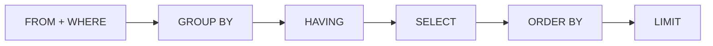

# Лекція 11. Сортування і фільтрація (ORDER BY, DISTINCT, BETWEEN, IN, LIKE)

*Досі результат запиту виходив у тому порядку, у якому SQLite фізично
знаходив рядки — непередбачуваному й невартому довіри порядку. І досі
умови `WHERE` писалися по одній через `AND`/`OR`. Ця лекція дає
інструменти, що роблять результат передбачуваним (`ORDER BY`),
компактним (`DISTINCT`) і зручнішим для типових умов —
"у діапазоні" (`BETWEEN`), "один зі списку" (`IN`), "схоже на
шаблон" (`LIKE`).*

## 1. ORDER BY — керований порядок результату

```sql
SELECT name, age
FROM animals
ORDER BY age DESC;
```

`ORDER BY колонка` сортує готовий результат за значенням колонки:
`ASC` (зростання, за умовчанням) або `DESC` (спадання). Без `ORDER BY`
порядок рядків результату не гарантований жодним стандартом — навіть
якщо на практиці він здається стабільним, покладатися на це не варто.

## 2. Сортування за кількома колонками

```sql
SELECT name, species, age
FROM animals
ORDER BY species ASC, age DESC;
```

Кожна наступна колонка в `ORDER BY` — це "тай-брейк" для рядків, у
яких попередні колонки рівні: спершу всі рядки групуються за
зростанням `species`, а вже в межах однакового виду сортуються за
спаданням `age`.

## 3. Місце ORDER BY в конвеєрі запиту



`ORDER BY` виконується ПІСЛЯ `SELECT` — саме тому, на відміну від
`WHERE` (Лекція 3), воно вільно посилається на псевдонім із `SELECT`:

```sql
SELECT name, age AS animal_age
FROM animals
ORDER BY animal_age DESC;
```

А `LIMIT` (Лекція 4) іде останнім у конвеєрі: спершу сортуємо ВЕСЬ
результат, і лише потім відрізаємо перші рядки — це і є типовий
шаблон "топ-N":

```sql
-- 2 найстарші тварини на обліку
SELECT name, age
FROM animals
WHERE status = 'на обліку'
ORDER BY age DESC
LIMIT 2;
```

## 4. DISTINCT — усунення дублікатів

```sql
SELECT DISTINCT species
FROM animals;
```

`DISTINCT` прибирає рядки-дублікати з результату. З однією колонкою —
це список унікальних значень. З кількома колонками `DISTINCT`
застосовується до всієї **комбінації**:

```sql
SELECT DISTINCT species, age
FROM animals;
-- унікальні ПАРИ (вид, вік) — (кіт, 3) і (собака, 3) вважаються РІЗНИМИ рядками
```

## 5. BETWEEN — діапазон включно з обома межами

```sql
SELECT name, age
FROM animals
WHERE age BETWEEN 3 AND 5;
-- рівнозначно: WHERE age >= 3 AND age <= 5
```

`BETWEEN a AND b` — скорочення для "від a до b включно з обома
кінцями" (перевірено: рядок з `age = 5` потрапляє в результат).
`NOT BETWEEN a AND b` — заперечення, "поза діапазоном".

## 6. IN — один зі списку значень

```sql
SELECT name, species
FROM animals
WHERE species IN ('кіт', 'миша');
-- рівнозначно: WHERE species = 'кіт' OR species = 'миша'
```

`IN (...)` замінює ланцюжок `OR` з однаковою колонкою — компактніше й
читабельніше за довгий список `OR`. `NOT IN (...)` — заперечення,
"жодне зі списку".

## 7. LIKE — пошук за шаблоном, і його пастка з кирилицею

```sql
SELECT name
FROM animals
WHERE name LIKE 'Р%';
-- % = будь-яка кількість будь-яких символів (включно з нулем)

SELECT name
FROM animals
WHERE name LIKE '____';
-- _ = РІВНО один будь-який символ; чотири "_" тут = рівно 4 символи
```

**Важлива й неочевидна особливість SQLite, перевірена окремо:**
`LIKE` за умовчанням регістронезалежний — але **лише для символів
ASCII (латиниця)**. Для кирилиці SQLite (без розширення ICU) працює
регістро**залежно**:

```sql
SELECT * FROM t2 WHERE w LIKE 'hello';
-- знаходить і 'Hello', і 'hello', і 'HELLO' — ASCII, регістр не важить

SELECT name FROM animals WHERE name LIKE 'рекс';
-- знаходить ЛИШЕ 'рекс' (малі літери) — 'Рекс' (з великої) НЕ знайдено!
```

Оскільки практично всі текстові дані цього курсу — українською,
це не теоретична деталь: пошук `LIKE 'іванов%'` пропустить рядок
`'Іванов'`, написаний з великої букви. Практичний висновок — для
надійного регістронезалежного пошуку кирилицею писати шаблон із
завідомо правильним регістром (чи, забігаючи наперед, привести обидва
боки до одного регістру функцією `LOWER()`/`UPPER()`), а не
покладатися на регістронезалежність `LIKE`, як для латиниці.

## Підсумок

- `ORDER BY колонка [ASC|DESC]` сортує готовий результат; без нього
  порядок рядків не гарантований. Кілька колонок — це послідовні
  тай-брейки.
- `ORDER BY` виконується після `SELECT` (можна посилатись на
  псевдонім), а `LIMIT` — після `ORDER BY`: разом вони дають шаблон
  "топ-N".
- `DISTINCT` прибирає дублікати рядків; з кількома колонками —
  дублікати цілої комбінації значень.
- `BETWEEN a AND b` включає обидва кінці; `IN (...)` замінює ланцюжок
  `OR` з однаковою колонкою.
- `LIKE` у SQLite регістронезалежний лише для ASCII — для кирилиці він
  регістрозалежний, що варто пам'ятати при пошуку українського тексту.

**Практика до цієї лекції:** [Практика 11. Сортування і фільтрація](../practice/11-sorting-filtering.md)

## Рекомендована література

Ужгородський національний університет, інженерно-технічний факультет (уклад.). *Організація баз даних: Робота з базами даних. Методичні вказівки і завдання до лабораторних робіт.* — Ужгород: ДВНЗ «Ужгородський національний університет», 2021 ([відкритий доступ](https://www.uzhnu.edu.ua/en/infocentre/get/42933)). Лабораторні роботи 2 та 4 — сортування (ORDER BY) і фільтрація (WHERE, оператори порівняння, LIKE, BETWEEN, IN).

Харів Н. О. *Бази даних та інформаційні системи.* — Рівне: НУВГП (Національний університет водного господарства та природокористування), 2018 ([відкритий доступ](https://ep3.nuwm.edu.ua/9129/3/%D0%A5%D0%B0%D1%80%D1%96%D0%B2%20%D0%9D.%D0%9E.pdf)). Розділ SQL — конструкції WHERE та ORDER BY в SELECT-запитах.
