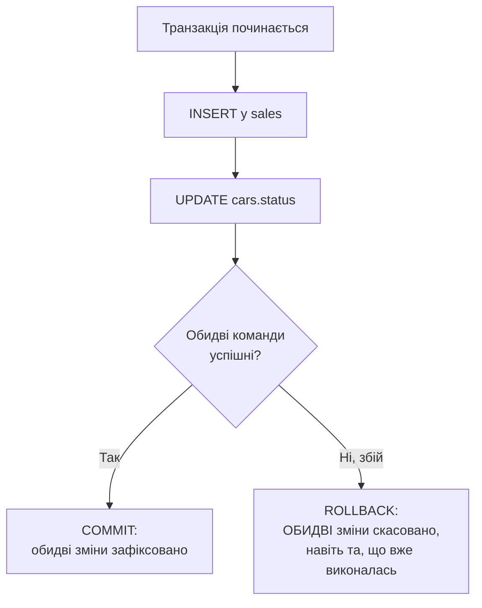

# Лекція 13. Принципи ACID і необхідність транзакцій

*Практика 12 і наступні дедалі частіше вимагатимуть не одну команду,
а КІЛЬКА пов'язаних команд, які мають відбутися разом — наприклад,
"продати автомобіль" означає одразу і додати рядок у `sales`, і
позначити авто як `'продано'` у `cars`. Що станеться, якщо перша
команда виконалась, а друга — ні (збій програми, втрата з'єднання,
помилка)? Ця лекція пояснює, чому таку "пару" операцій потрібно
розглядати як єдине неподільне ціле, і що станеться з базою, якщо
цього не зробити.*

## 1. Мотивуюча проблема: розірвана пара операцій

Уявімо продаж автомобіля без жодного спеціального механізму — просто
дві послідовні команди:

```sql
INSERT INTO sales (car_id, client_id, sale_date, sale_price)
VALUES (5, 3, '2025-06-10', 980000);

UPDATE cars SET status = 'продано' WHERE id = 5;
```

Якщо перша команда виконалась, а друга не встигла (програма впала,
зникло живлення, помилка мережі до бази на сервері) — база залишається
в **неузгодженому стані**: запис про продаж уже існує, а сам автомобіль
досі позначений як `'в наявності'`. Другий продавець теоретично може
продати той самий автомобіль вдруге. Проблема не в самому SQL —
обидві команди написані правильно, — а в тому, що між ними немає
жодної гарантії "або обидві, або жодна".

## 2. Транзакція — неподільна група операцій

**Транзакція** — це група SQL-команд, яка виконується як одне
неподільне ціле: або ВСІ команди групи застосовуються до бази, або
(у разі будь-якого збою чи свідомої відмови) — **жодна**. Проміжного
стану "виконалась лише половина групи" в базі після завершення
транзакції не залишається ніколи.



Синтаксис (`BEGIN`, `COMMIT`, `ROLLBACK`) — тема наступної лекції; тут
важливий сам принцип: рішення "зафіксувати" чи "скасувати" приймається
для ВСІЄЇ групи одразу, а не для кожної команди окремо.

## 3. ACID — чотири властивості надійної транзакції

**ACID** — акроним чотирьох властивостей, які має гарантувати кожна
транзакція в надійній СУБД (включно з SQLite):

- **Atomicity (атомарність)** — "все або нічого": з прикладу вище,
  `INSERT` у `sales` і `UPDATE` в `cars` або застосовуються ОБИДВА, або
  жоден. Це саме та властивість, що вирішує мотивуючу проблему з
  розділу 1.
- **Consistency (узгодженість)** — транзакція переводить базу з одного
  коректного стану в інший коректний стан: усі обмеження цілісності
  (`NOT NULL`, `UNIQUE`, `CHECK`, зовнішні ключі — Лекція 6) мають
  виконуватись і до, і після транзакції. Транзакція, що порушила б
  обмеження, не застосовується взагалі.
- **Isolation (ізольованість)** — якщо з базою одночасно працює кілька
  користувачів (чи процесів), одна незавершена транзакція не повинна
  бути видимою для іншої, доки не завершиться. SQLite в типовому
  однокористувацькому режимі цієї практики це гарантує на рівні файлу
  бази (детальніше — за межами цього курсу, у СУБД для багатьох
  користувачів, як PostgreSQL, це складніший механізм).
- **Durability (стійкість)** — якщо транзакція завершилась успішно
  (`COMMIT`), її результат гарантовано зберігається навіть у разі
  збою живлення чи аварійного завершення програми одразу після цього —
  дані вже записані на диск, а не лише в пам'яті.

## 4. Без явної транзакції: кожна команда — сама собі транзакція

```sql
INSERT INTO sales (car_id, client_id, sale_date, sale_price)
VALUES (5, 3, '2025-06-10', 980000);
-- у цьому місці зміна ВЖЕ зафіксована в базі, окремо від наступної команди

UPDATE cars SET status = 'продано' WHERE id = 5;
-- це друга, повністю НЕЗАЛЕЖНА транзакція
```

Це і є причина проблеми з розділу 1: без явного `BEGIN`/`COMMIT`
кожна окрема команда SQL виконується як **своя власна, неявна
транзакція** — застосовується одразу, незалежно від сусідніх команд.
Щоб дві (чи більше) команди утворили одну спільну транзакцію, потрібно
явно позначити її межі — синтаксис `BEGIN`/`COMMIT`/`ROLLBACK`
розглядає Лекція 14.

## Підсумок

- Транзакція — неподільна група SQL-команд: результат застосовується
  до бази або весь одразу, або не застосовується взагалі.
- **ACID**: Atomicity (все або нічого), Consistency (обмеження
  цілісності виконуються завжди), Isolation (незавершена транзакція не
  видима іншим), Durability (зафіксований результат переживає збій).
- Без явного `BEGIN`/`COMMIT` кожна окрема команда — власна неявна
  транзакція, і саме тому пов'язана пара команд без явних меж
  транзакції може "розірватися" при збої між ними.

**Наступна лекція:** [Лекція 14. Транзакції у SQLite: BEGIN, COMMIT, ROLLBACK](15-transactions.md)

## Рекомендована література

Павловський В. І., Петрашенко А. В. *Бази даних та засоби управління.* — Київ: КПІ ім. Ігоря Сікорського, 2024 ([відкритий доступ](https://ela.kpi.ua/bitstreams/9f26675d-c42f-485e-aab5-13e6e014b560/download)). Розділ про транзакції та багатокористувацький паралельний доступ — властивості транзакцій, рівні ізоляції.

Харів Н. О. *Бази даних та інформаційні системи.* — Рівне: НУВГП (Національний університет водного господарства та природокористування), 2018 ([відкритий доступ](https://ep3.nuwm.edu.ua/9129/3/%D0%A5%D0%B0%D1%80%D1%96%D0%B2%20%D0%9D.%D0%9E.pdf)). Розділ «Транзакції» — властивості ACID у контексті реалізації транзакцій у Firebird/IBExpert.
