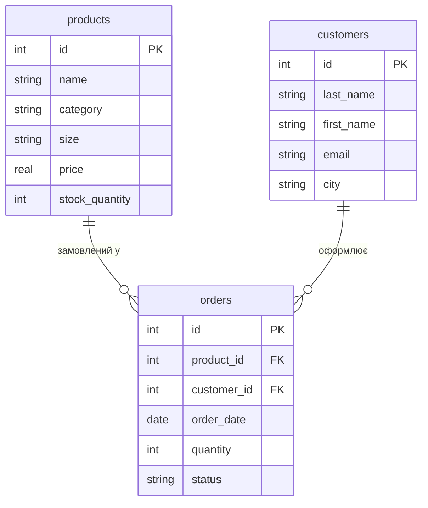
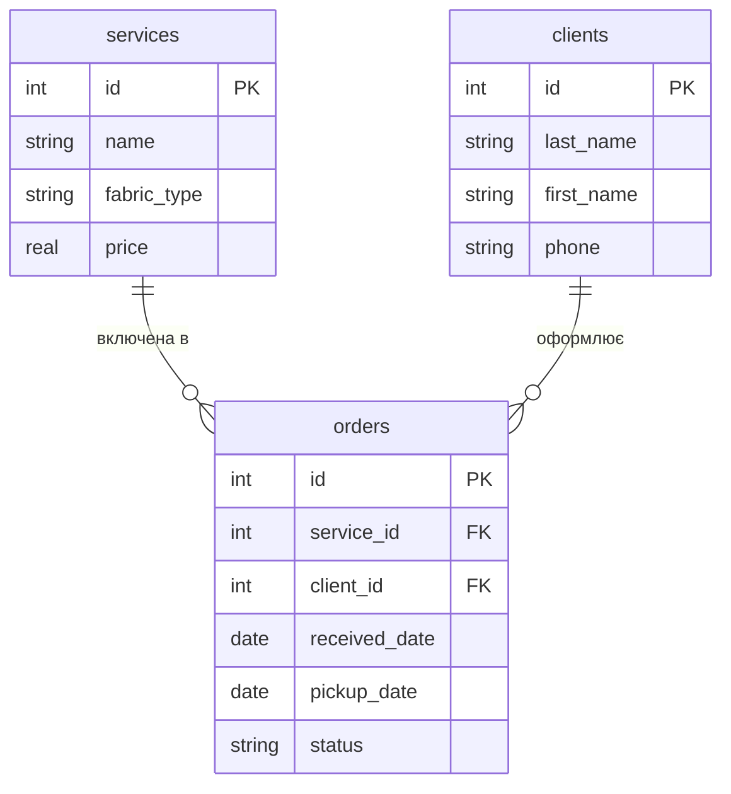

# Практика 3. Створення ER-діаграм для заданих прикладів

*Мета заняття: спроєктувати — ще без жодної зміни файлу бази даних —
повну ER-діаграму своєї предметної області: обидві вимірні таблиці й
фактову таблицю з двома зовнішніми ключами. Це чисте планування перед
реалізацією: у Практиці 1 ви вже створили першу (вимірну) таблицю
свого варіанта, а друга таблиця й фактова таблиця з'являться у файлі
`.db` аж у Практиці 4. Сьогодні — тільки діаграма й аналіз на папері
чи в markdown-клітинці ноутбука.*

## Варіант

Номер варіанта — той самий, що ви отримали в
[Практиці 1](01-sqlite-create.md); там наведена лише таблиця-вимір 1,
яку ви вже створили. Сьогодні знадобиться **повний рядок** вашого
варіанта — з усіма трьома таблицями, — і саме він наведений нижче
(так само в Практиці 4 ви повернетесь саме до цієї таблиці, а не до
таблиці з Практики 1).

| № | Тема | Таблиця-вимір 1 | Таблиця-вимір 2 | Факт/журнальна таблиця |
|---|---|---|---|---|
| 1 | Бібліотека | `books(id, title, author, publication_year, genre, copies_count)` | `readers(id, last_name, first_name, email, registration_date)` | `loans(id, book_id→books, reader_id→readers, loan_date, return_date)` |
| 2 | Інтернет-магазин одягу | `products(id, name, category, size, price, stock_quantity)` | `customers(id, last_name, first_name, email, city)` | `orders(id, product_id→products, customer_id→customers, order_date, quantity, status)` |
| 3 | Кінотеатр | `movies(id, title, genre, duration_min, year, age_rating)` | `viewers(id, last_name, first_name, email, phone)` | `tickets(id, movie_id→movies, viewer_id→viewers, hall, showtime, price, seat, purchase_date)` |
| 4 | Аптека | `medicines(id, name, manufacturer, form, price, stock_quantity)` | `suppliers(id, name, contact_person, phone, city)` | `deliveries(id, medicine_id→medicines, supplier_id→suppliers, delivery_date, quantity, purchase_price)` |
| 5 | Автосалон | `cars(id, brand, model, year, price, status)` | `clients(id, last_name, first_name, phone, email)` | `sales(id, car_id→cars, client_id→clients, sale_date, sale_price)` |
| 6 | Готель | `rooms(id, type, price_per_night, capacity, status)` | `guests(id, last_name, first_name, email, phone)` | `bookings(id, room_id→rooms, guest_id→guests, check_in_date, check_out_date)` |
| 7 | Спортзал (фітнес-клуб) | `memberships(id, type, duration_days, price)` | `clients(id, last_name, first_name, phone, birth_date)` | `membership_sales(id, membership_id→memberships, client_id→clients, purchase_date, expiration_date)` |
| 8 | Служба доставки їжі | `dishes(id, name, category, price, restaurant)` | `couriers(id, last_name, first_name, phone, transport)` | `orders(id, dish_id→dishes, courier_id→couriers, order_date, address, status)` |
| 9 | Університет (деканат) | `students(id, last_name, first_name, group_name, admission_year)` | `courses(id, title, credits, semester)` | `grades(id, student_id→students, course_id→courses, grade, grade_date)` |
| 10 | Транспортна компанія | `drivers(id, last_name, first_name, experience_years, license_category)` | `routes(id, origin, destination, distance_km)` | `trips(id, driver_id→drivers, route_id→routes, trip_date, duration_min)` |

Назви таблиць і стовпців — англійською (`snake_case`), як і в
Практиці 1; стрілка `→` показує, на яку таблицю й через яку саме
таблицю-вимір веде кожен зовнішній ключ фактової таблиці. Обидва
зв'язки кожного варіанта — 1:N (детальніше — у Завданні 2 нижче).

## Синтаксис опису сутностей у erDiagram

Перш ніж переходити до прикладу, розберіть сам формат запису сутності.
Кожна сутність у mermaid `erDiagram` записується блоком:

```
назва_сутності {
    тип назва_стовпця [PK|FK]
    ...
}
```

- **`назва_сутності`** стане назвою майбутньої таблиці (англійською,
  `snake_case`).
- Кожен рядок усередині `{ }` — один майбутній стовпець: спочатку йде
  **абстрактний тип** (`int`, `string`, `real`, `date` — це логічний
  рівень моделювання, ще не точний тип конкретної СУБД: те, що тут
  `int`, у SQLite стане `INTEGER`, а в PostgreSQL, наприклад,
  `SERIAL`), потім — назва стовпця.
- Необов'язкова третя частина рядка — **роль** стовпця: `PK` (primary
  key, первинний ключ — однозначно ідентифікує кожен рядок таблиці) або
  `FK` (foreign key, зовнішній ключ — посилається на первинний ключ
  **іншої** таблиці й тим самим фізично реалізує зв'язок, намальований
  лінією між сутностями). Стовпець без жодної позначки — звичайний
  атрибут, не ключ.

Приклад — інтернет-магазин одягу (products, customers, orders):



Розберіть, як саме розподілені PK і FK у цих трьох блоках:

- `products` і `customers` — вимірні таблиці: у кожної рівно один PK
  (`id`) і жодного FK. Вони самодостатні й ні на кого не посилаються —
  саме тому це "виміри", а не "факти".
- `orders` — фактова таблиця: власний PK (`id`), плюс **два** FK —
  `product_id` і `customer_id`. FK завжди того самого абстрактного
  типу, що й PK, на який він посилається (тут обидва — `int`, бо й
  `products.id`, і `customers.id` — теж `int`). Рівно два FK у
  фактовій таблиці — по одному на кожну вимірну таблицю, з якою вона
  зв'язана: це не збіг, а прямий наслідок того, що фактова таблиця
  з'єднує дві вимірні.

У Завданні 1 ви запишете схему свого варіанта в точнісінько такому ж
форматі — просто з іншими назвами сутностей і стовпців.

## Приклад: наскрізна демонстрація

Розберіть цей приклад — домен **«Хімчистка»** (services, clients,
orders) — перш ніж малювати діаграму свого варіанта. Це окремий,
одноразовий приклад: він не збігається ні з жодним із 10 варіантів
курсу, ні з Ветклінікою з лекції.

Предметна область словами: хімчистка пропонує різні **послуги**
(чистка пальта, чистка килима тощо, кожна зі своєю ціною); у хімчистки
є постійні **клієнти**; кожне конкретне **замовлення** — це запис про
те, що конкретний клієнт здав конкретну річ на конкретну послугу в
конкретний день.



Пояснення кожної кардинальності:

- `services ||--o{ orders` — **1:N**. Рівно одна послуга (наприклад,
  "чистка пальта") відповідає нулю або багатьом замовленням: ту саму
  послугу за час роботи хімчистки замовляють десятки разів (або жодного
  разу, якщо послуга нова й на неї ще нема клієнтів), але кожне
  конкретне замовлення стосується рівно однієї послуги — не можна в
  одному замовленні одночасно "почистити пальто" і "почистити килим" як
  одну позицію.
- `clients ||--o{ orders` — **1:N**. Рівно один клієнт відповідає
  нулю або багатьом замовленням: постійний клієнт здає речі багато
  разів, новий клієнт у базі — поки жодного разу, але кожне замовлення
  оформлює рівно один клієнт.
- Прямого зв'язку між `services` і `clients` на діаграмі немає — вони
  пов'язані лише **через** `orders`, і саме так фактова таблиця
  завжди й працює: вона з'єднує дві вимірні таблиці, які одна з одною
  напряму не пов'язані.

## Завдання

Виконайте всі пункти на **своєму** варіанті з Практики 1 і запишіть
результат у markdown-клітинку ноутбука (`.ipynb`) або в окремий
текстовий файл `er-diagram.md` — на вибір, файл бази даних сьогодні не
чіпаємо.

**Завдання 1. ER-діаграма повної схеми.** Намалюйте mermaid-код
`erDiagram` повної схеми свого варіанта: обидві вимірні таблиці й
фактову таблицю з двома зовнішніми ключами, за зразком прикладу вище.
Використайте точні назви таблиць і стовпців зі свого рядка таблиці
варіантів (розділ 9а довідки курсу — назви таблиць і стовпців англійською
з позначенням `→`, куди веде кожен зовнішній ключ), позначте первинні
ключі `PK`, зовнішні — `FK`, і поставте правильні позначення
кардинальності на обох зв'язках.

**Завдання 2. Тип кожного зв'язку.** Письмово, для кожного з двох
зв'язків своєї діаграми: визначте, це 1:N чи M:N, і поясніть чому
одним-двома реченнями (як у прикладі вище). У всіх 10 варіантів курсу
обидва зв'язки — 1:N; якщо у вас вийшло інакше, перегляньте, яка
таблиця "вимірна", а яка "фактова" — можливо, зв'язок намальовано в
неправильному напрямку.

**Завдання 3. Первинні й зовнішні ключі кожної таблиці.** Для кожної з
трьох таблиць своєї схеми випишіть окремим списком: (а) який стовпець
— первинний ключ; (б) які стовпці — зовнішні ключі і на яку таблицю
кожен із них посилається. Це не потребує SQL — просто список; сам
синтаксис `PRIMARY KEY`/`FOREIGN KEY` знадобиться в Практиці 4, коли
ці ключі реально з'являться у файлі бази даних.

**Завдання 4. Якщо додати ще одну сутність.** Уявіть, що до вашої
предметної області потрібно додати ще одну сутність (наприклад, для
бібліотеки — "видавництва": кожна книга видана одним видавництвом,
одне видавництво видало багато книг). Придумайте одну змістовну
сутність для **своєї** теми і письмово опишіть: як зміниться діаграма
— яка нова таблиця з'явиться, куди піде новий зв'язок і якого типу він
буде (1:N чи M:N). Реалізовувати нічого не потрібно — лише описати
словами й, за бажанням, показати ескізом.

**Завдання 5. Порівняння з прикладом.** Порівняйте свою діаграму з
діаграмою хімчистки з розділу "Приклад" і письмово поясніть структурну
схожість: обидві складаються з двох вимірних таблиць і однієї фактової
з двома FK, обидва зв'язки в обох діаграмах — 1:N, і в обох випадках
дві вимірні таблиці пов'язані лише через фактову, а не напряму.

## Що здати й оцінюється

Ця практика — виняток із загальної конвенції `lab_work_N.sql` / `.db` /
`.md`: сьогодні ще немає жодного SQL-коду і жодної зміни файлу бази,
тож здайте лише один файл — `lab_work_3.md` — із зазначеним номером
варіанта, ER-діаграмою (mermaid `erDiagram`), п'ятьма виконаними
завданнями і відповідями на контрольні питання:

- Чим логічна модель відрізняється від концептуальної, і чим фізична —
  від логічної?
- Чому зв'язок M:N не можна реалізувати двома зовнішніми ключами в
  одній із двох основних таблиць і завжди потрібна окрема таблиця?
- Що означають позначення `||`, `o{`, `|{` у синтаксисі mermaid
  `erDiagram`, і як прочитати вголос рядок `A ||--o{ B`?

Оцінюється правильність ER-діаграми саме для вашого варіанта (точні
назви таблиць/стовпців, правильний напрямок і тип обох зв'язків,
коректні позначення кардинальності), а також повнота й обґрунтованість
письмових відповідей у Завданнях 2-5.

## Підсумок заняття

- Повна схема свого варіанта (2 вимірні таблиці + 1 фактова з двома FK)
  спроєктована на діаграмі — до того, як хоч один рядок SQL буде
  написаний для другої й третьої таблиці.
- Обидва зв'язки схеми визначені за типом (1:N) і обґрунтовані.
- Первинні та зовнішні ключі кожної таблиці виписані окремо — це готовий
  план для Практики 4, де вони стануть реальним `PRIMARY KEY`/`FOREIGN
  KEY` у файлі бази даних.
- Розглянуто, як діаграма зміниться при додаванні нової сутності — без
  реалізації, лише як вправа на розуміння структури.

**Лекція до цієї практики:** [Лекція 4. Рівні проєктування баз даних. ER-діаграми](../lectures/04-er-modeling.md)

## Рекомендована література

Жученко А. І., Ярощук Л. Д. *Проєктування інформаційних систем: Бази даних.* — Київ: КПІ ім. Ігоря Сікорського, 2022 ([відкритий доступ](https://files.znu.edu.ua/files/Bibliobooks/Inshi83/0063533.pdf)). Розділ 5 — ER-моделювання: інфологічні моделі, нотації Чена та «Вороняча лапка» (Crow's Foot), відображення зв'язків і кардинальності.

Харів Н. О. *Бази даних та інформаційні системи.* — Рівне: НУВГП (Національний університет водного господарства та природокористування), 2018 ([відкритий доступ](https://ep3.nuwm.edu.ua/9129/3/%D0%A5%D0%B0%D1%80%D1%96%D0%B2%20%D0%9D.%D0%9E.pdf)). Теоретичний розділ — модель «сутність-зв'язок» (ER-модель) як етап проектування реляційної БД.
