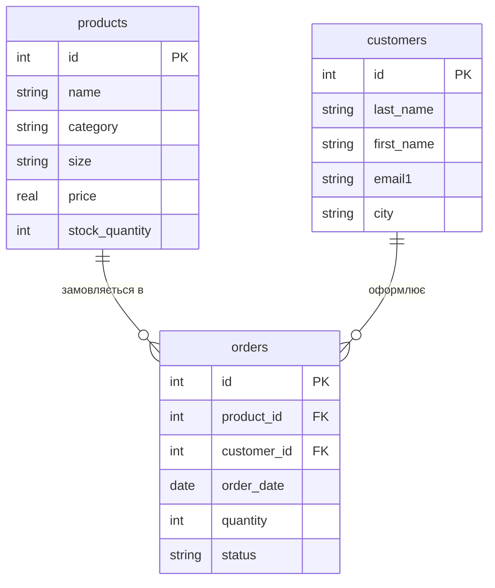

# Практика 3. Створення ER-діаграм для заданих прикладів
**Студентка:** Батура Каріна Віталіївна
**Група:** ІТ-31
**Варіант:** №2 — Інтернет-магазин одягу

## Завдання 1. ER-діаграма повної схеми

Пояснення
**products** та **customers** мають тільки первинні ключі id PK.
orders — це фактова таблиця, яка об'єднує їх. Вона має свій id P` та два зовнішні ключі: product_id FK(посилання на products) та customer_id FK (посилання на customers).
Зв'язок ||--o{ означає 1:N (один-до-багатьох): один товар чи клієнт може відповідати багатьом замовленням.

## Завдання 2. Тип кожного зв'язку

1. **products — orders (1:N):**
   Один товар з таблиці products може фігурувати в нулі або багатьох замовленнях з таблиці orders, оскільки один і той самий товар купують різні покупці в різний час. Проте кожен окремий запис у таблиці замовлень посилається суворо на один конкретний товар.

2. **customers — orders (1:N):**
   Один клієнт з таблиці customers може зробити декілька замовлень у таблиці orders (або не зробити жодного, якщо це тільки-но зареєстрований акаунт). Але кожне конкретне замовлення оформлює рівно один клієнт.

## Завдання 3. Первинні й зовнішні ключі кожної таблиці

* **products (таблиця-вимір 1):**
  * Первинний ключ (PK): id
  * Зовнішні ключі (FK): відсутні

* **customers (таблиця-вимір 2):**
  * Первинний ключ (PK): id
  * Зовнішні ключі (FK): відсутні

* **orders (фактова / журнальна таблиця):**
  * Первинний ключ (PK): id
  * Зовнішні ключі (FK):
    * product_id — посилається на products(id)
    * customer_id — посилається на customers(id)

---

## Завдання 4. Додавання нової сутності

У нашу схему можна додати таблицю **brands (Бренди)**.

* **Поля:** id (PK, унікальний код), brand_name (назва бренду), country (країна).
* **Як зміниться схема:** Додасться зв'язок **1:N** між brands та products (brands ||--o{ products). Один бренд створює багато товарів, але конкретна річ належить одному бренду. У таблицю products додамо зовнішній ключ brand_id (FK).

## Завдання 5. Порівняння з прикладом (Хімчистка)

Обидві схеми мають однакову структуру:
* **Схема-зірка:** Є дві окремі таблиці-довідники (products і customers у нас; services і clients у хімчистці) та одна центральна таблиця замовлень (orders).
* **Зв'язки:** Таблиця orders об'єднує два довідники через два зовнішні ключі (FK). Усі зв'язки мають тип **1:N** (від довідника до замовлень).
* **Незалежність:** Товари й покупці не пов'язані між собою напряму — вони перетинаються тільки під час оформлення замовлення.

---

## Відповіді на контрольні питання

### 1. Чим логічна модель відрізняється від концептуальної, і чим фізична від логічної?
* **Концептуальна модель** описує бізнес-сутності та зв'язки загалом, без деталей (просто поняття Товари, Клієнти, Замовлення).
* **Логічна модель** уточнює структуру: додає всі поля, первинні й зовнішні ключі (PK/FK) та абстрактні типи даних (int, string), незалежно від конкретної бази даних.
* **Фізична модель** — це реалізація під конкретну СУБД (наприклад, SQLite), де враховано точні типи даних (INTEGER PRIMARY KEY, TEXT, REAL) та синтаксичні правила.

### 2. Чому зв'язок M:N не можна реалізувати двома зовнішніми ключами в одній із двох основних таблиць?

Тому що один зовнішній ключ у рядку може вказувати лише на один запис з іншої таблиці. Спроба записати декілька ключів через кому порушує правила побудови баз даних і унеможливлює перевірку цілісності даних у SQL. Для зв'язку багато-до-багатьох завжди потрібна окрема третя таблиця (фактова), яка розбиває його на два зв'язки 1:N.

### 3. Що означають позначення ||, o{, |{ у синтаксисі Mermaid, і як прочитати вголос рядок A ||--o{ B?
* **||** означає рівно один.
* **o{** означає нуль або багато.
* **|{** означає один або багато.

Рядок **A ||--o{ B** вголос читається так: один екземпляр сутності A відповідає нулю або багатьом екземплярам сутності B (зв'язок один-до-багатьох).